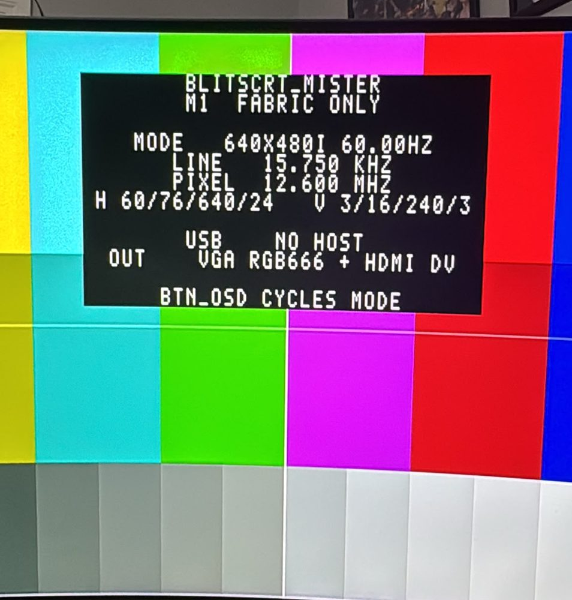
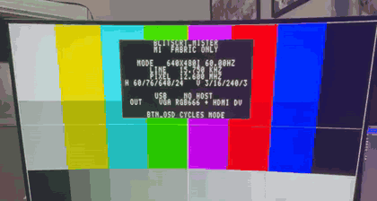
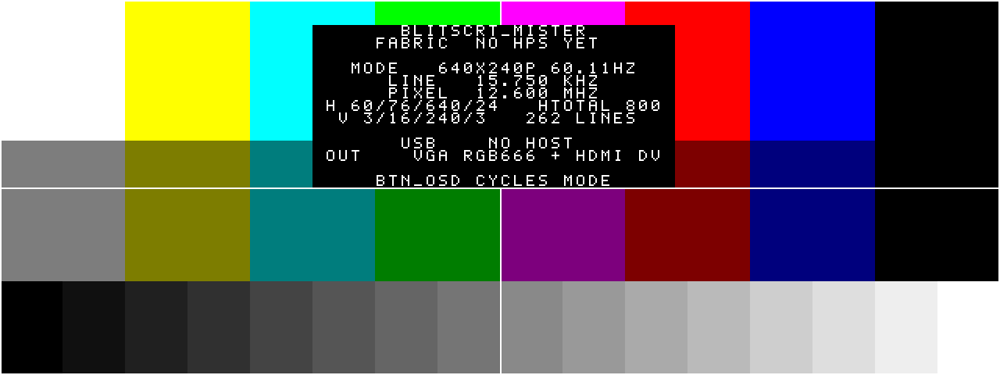
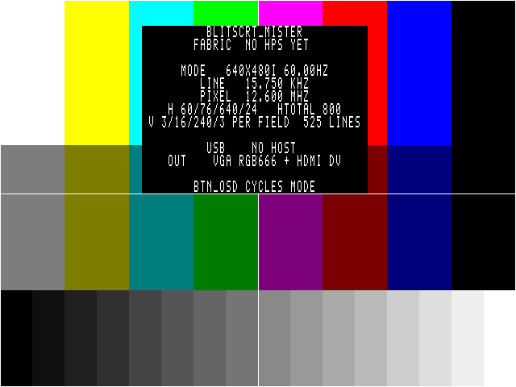
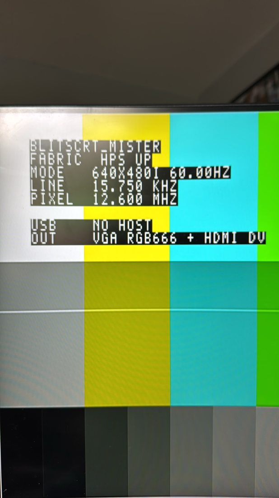

# blitsCRT_Mister

A 15kHz analog video card that enumerates over USB as a display.

It runs. 640x480i60 at a 15.750 kHz line rate, generated by the fabric and
locked onto by a real display. Colour bars, a mode readout and runtime mode
switching, out of the analog board and HDMI at the same time.

Both outputs carry the same pixel stream. Analog RGB666 goes out of the A/V
board's VGA connector for a CRT, and the same raster goes out of HDMI as Direct
Video. For SCART, set the `CSYNC` parameter and use a VGA-to-SCART lead.

The GUD device daemon in `sw/` is written and tested, and the fabric it drives
is built: register file, PLL with runtime reconfiguration, and the HPS bridge
that carries commands between them. What none of it has had yet is a power-on on
real hardware with a host attached.

**Status** below has the detail of what is done and what is not.

## Quick start

```
make setup      # 1. install the toolchain (cross-compiler, iverilog, dtc, git)
make world      # 2. build everything the installed tools allow
make sd DEST=/path/to/mounted/card      # 3. copy rbf + kernel to the card, then set the u-boot env
```

`make setup` is the first step: it installs the build dependencies through the
package manager and offers to clone a kernel tree. It does not install Quartus,
which is a manual licensed download — see **Prerequisites**. `make world` then
builds whatever it finds a toolchain for and skips the rest with a note naming
what is missing, so a partial toolchain still yields a partial build rather
than an error. **Prerequisites** and **Build** have the detail.

## Lineage

This grew out of **BlitCRT** — <https://github.com/alphanu1/blitcrt> — my 15kHz
FPGA video card. It is a blit streamer: the host pushes damage rectangles
straight into live scanout over FT245. No present, no flip, nothing to double
buffer.

Before that I wrote MME4CRT, RetroArch's 15kHz support, and CRTPi.

**This is a blit streamer too.** The model is defined by the write path, not by
where the pixels live. BlitCRT keeps a 4bpp frame on-chip in block RAM and is
still a streamer, because rects go into live scanout and nothing is ever
presented or flipped. Same here.

GUD suits that. It is a damage-rect protocol: a cursor crossing a static screen
costs a few hundred bytes instead of a megabyte, and there is no frame
submission step anywhere in it.

What changes is how much scanout memory the write path needs, and this board has
far more of it than the Cyclone IV BlitCRT runs on. See **Scanout memory** below
for where the pixels go. M3 is the plumbing, not a change of model.

Target is the MiSTer Pi (Cyclone V SE 5CSEBA6U23I7) with the analog A/V board.
A DE10-Nano works identically.



*Work in progress. The fabric running on a MiSTer Pi, mode 1 at 640x480i60,
out of HDMI as Direct Video. The overlay is reading its own timing back: 15.750
kHz line rate, 12.600 MHz pixel clock, and the porch numbers the timing
generator was handed.*

*This shot predates the current banner text, which spells out that the vertical
values are per field and gives the totals. The photograph is otherwise what the
hardware does.*



*The same thing moving.*

[Full clip, 640x480i60 out of HDMI](docs/video/runtime_m1.mp4)

Below is the same design rendered from simulation, one pixel at a time straight
out of the datapath:



## The goal

A blit streamer that a host treats as an ordinary display, driving a 15kHz CRT
with no emulator in the path.

The device implements GUD (Generic USB Display). On any Linux machine it
enumerates as a `drm_device` — a real `/dev/dri/card*`. Nothing on the host knows
or cares that the panel is a CRT hung off an FPGA. Drag a window onto it, run a
native arcade port, or point Wayland at it, and the pixels come out at 15kHz. That
is the whole point: the CRT stops being tied to an emulator pipeline and becomes a
display the OS can use for anything.

GUD is a wire protocol rather than a Linux one, so the host end is not fixed. A
Windows driver over IddCx would work against the same hardware unchanged -- that is
**M7**, and it will most likely live in its own repository, since such a driver is
useful to any GUD device and not just this one.

This is a different approach from the emulator-driven path. There, a guest has
to run something like GroovyMAME with exact modelines and beam-timed updates to
push frames. Here the work happens at the kernel driver layer on the host, and
GUD's damage-rectangle model means only changed pixels cross the wire. The
device takes those rectangles into scanout memory and reads them out as a 15kHz
raster.

A few specifics, since they are easy to assume wrong:

- **No compression on the wire, for now.** GUD can negotiate LZ4 and the device
  declines it. The 240p modes fit raw with room to spare -- a 384x224p60 frame in
  RGB565 is 10 MB/s against USB 2.0's ~35 MB/s of bulk, full-screen motion and
  every pixel changing. The 640-wide modes are the ones that need help, and by
  about five per cent. See **M5**.
- **The transport is the general-purpose HPS port, not AXI or DMA.** Register
  and pixel access marshals through the 32-bit `gp` interface the board already
  brings out. The seam that carries it (`rtl/blitscrt_bridge.v`) can be switched
  to the lightweight AXI bridge with one parameter, but the built path is the
  simpler gp one.
- **It is a blit streamer, not a line-by-line transceiver with no memory.** The
  device holds scanout memory; the raster reads from it on the pixel clock while
  the host writes into it whenever it likes. See **Lineage** for why that
  storage is required and why it is still a streamer.

The host does the rendering. The board is a USB-to-CRT display that happens to
be an FPGA.

## Relationship to MiSTer

blitsCRT_Mister is not a MiSTer core. It does not use the MiSTer framework,
`hps_io`, the OSD, or the MiSTer menu, and it does not run any MiSTer core. It
runs its **own** kernel on the MiSTer hardware.

What it borrows from a MiSTer card is the low-level boot: the A2 preloader (which
brings up DDR3 and the HPS pin mux) and the u-boot binary. Above that, BlitsCRT
replaces the environment entirely. u-boot is repointed to program `blitscrt.rbf`
onto the fabric and boot the BlitsCRT kernel directly, with no menu, no `.rbf`
hand-off, and no MiSTer Linux. It is a **dedicated boot**: this card powers
straight into BlitsCRT.

Because the kernel is ours, the USB OTG port can be put in peripheral mode, which
the GUD host link needs and which the stock MiSTer kernel, being USB-host only,
cannot do.

The boot procedure is in **Bringing up the HPS side** below.

## What it does

- Analog RGB666 out of the A/V board. The same stream out of HDMI as Direct Video
- Eight-bar colour test card, half-amplitude bars, 16-step greyscale ramp,
  one-pixel border, centre crosshair
- Idle screen giving mode, line rate, pixel clock, porch numbers, host status
  and which outputs are live
- `BTN_OSD` cycles the mode. `BTN_USER` hides the overlay. `BTN_RESET` resets
  the video pipeline

### Modes

Modes are dynamic. The point of the whole thing is that the host names a
timing and the board produces it, which is how Switchres works: a modeline per
game, arbitrary pixel clocks, nothing fixed in advance.

The software side already does this. `sw/modes.c` takes any DRM mode a host
hands over, checks it against what a 15kHz CRT will survive, and `sw/pll.c`
solves the PLL counters for the clock. Worst case across real console and
arcade timings is 6 ppm. The mode list itself is dynamic too: modes can be
added at runtime and the host re-reads them without re-enumerating the USB
device.

### What the daemon advertises

Four modes, with 640x480i60 first and flagged `PREFERRED`, which is what a host
picks on first connect.

| mode | pixel clock | line | field | |
|---|---|---|---|---|
| **640x480i60** | 12.600 MHz | 15.750 kHz | 60.00 Hz | preferred, NTSC 480i |
| 640x576i50 | 12.500 MHz | 15.625 kHz | 50.00 Hz | PAL 576i |
| 320x240p60 | 6.300 MHz | 15.750 kHz | 60.11 Hz | NTSC 240p |
| 320x288p50 | 6.250 MHz | 15.625 kHz | 50.08 Hz | PAL 288p |

Each 320-wide mode is exactly half its 640-wide partner, and the counters fall
out of the same VCO:

```
640x480i60   12.600 MHz   VCO 1575   C=125      NTSC pair
320x240p60    6.300 MHz   VCO 1575   C=250
640x576i50   12.500 MHz   VCO  800   C=64       PAL pair
320x288p50    6.250 MHz   VCO  800   C=128
```

Two VCOs cover all four, and within a VCO the 640 and 320 modes are one counter
apart. All four solve to 0 ppm. That is how the PLL is driven: reconfigure M and N
to swap VCO between NTSC and PAL, and take the two C outputs into the clock mux
for 640-wide against 320-wide. Two muxed PLL outputs is exactly what `altclkctrl`
allows.

This is the advertised list, not a limit. A host can set a timing that was never
in it, which is the Switchres case.

The fabric has three built-in modes, driven from its two compiled pixel clocks.
Anything beyond them is reached by reconfiguring the PLL at runtime:

| | mode | pixel clock | line | field | for |
|---|---|---|---|---|---|
| 0 | 640x240p60 | 12.600 MHz | 15.750 kHz | 60.11 Hz | 15kHz CRT |
| 1 | 640x480i60 | 12.600 MHz | 15.750 kHz | 60.00 Hz | 15kHz CRT, standard 480i |
| 2 | 640x480p60 | 25.200 MHz | 31.500 kHz | 60.00 Hz | any VGA or HDMI display |

Modes 0 and 1 share a clock. Switching between them never touches the PLL.

The timing generator itself has no built-in modes. Porches, active size and the
interlace flag are all inputs, latched while the pipeline is held in reset. It
will drive whatever timing it is given. Only the clock is pinned.

## The write path

The host does not send frames. GUD is a damage-rect protocol: after
`GUD_REQ_SET_BUFFER` names a rectangle, a bulk transfer carries only the pixels
inside it. A cursor moving across a static screen costs a few hundred bytes,
not a megabyte.

Rects land in scanout memory and the raster reads from it. There is no present
and no flip; the write path goes straight at the picture. GUD's kernel header
happens to call that region a framebuffer, but nothing in the protocol submits
a frame.

### Pixel formats

The A/V board is a six-bit resistor ladder per channel. **RGB666** is what
actually reaches the CRT. HDMI carries the same pixels widened to RGB888 by
replicating the top bits.

GUD has no RGB666 format and no indexed format either. The 4bpp palette idea
from BlitCRT does not map onto it at all. Three formats are offered:

| format | bytes/px | reaches the DAC as | note |
|---|---|---|---|
| **RGB888** | 3 | full 6/6/6 | truncated to the ladder, nothing wasted |
| RGB565 | 2 | 5/6/5 into 6/6/6 | gives up a bit on red and blue, halves the bandwidth |
| RGB332 | 1 | 3/3/2 into 6/6/6 | for tight bandwidth |

RGB888 would use the whole ladder and is not currently offered: `scanout_fetch.v`
cannot read three bytes per pixel. RGB565 is what a host gets, and what the
picture on the CRT is made of. See **M5** for the two-beat read window that
brings it back.

### Scanout memory

Two tiers are used, which is a different situation from the Cyclone IV BlitCRT
was built on.

| | size | notes |
|---|---|---|
| **M10K on-chip** | ~696 KB | no controller, lowest latency, no arbitration |
| **HPS DDR3** | 1 GB | always fitted, reached over the f2sdram bridge |

The MiSTer SDRAM module is deliberately not among them. Pixels arrive in DDR3
because that is where the USB gadget receives them, so putting them in a
fabric-side memory would mean reading them back out and pushing every one across
a bridge into something smaller, slower and optional. There is no SDRAM
controller in the design and none is planned.

What fits on-chip, leaving headroom for the rest of the design:

| mode | RGB332 | RGB565 | RGB888 |
|---|---|---|---|
| 640x240p60 | 150 KB, double-buffered | 300 KB, single | 450 KB, single |
| 640x480i60 | 300 KB, single | 600 KB, off-chip | 900 KB, off-chip |
| 640x480p60 | 300 KB, single | 600 KB, off-chip | 900 KB, off-chip |

That table is about capacity, and capacity turned out not to be the constraint.
The only way into block RAM is the gp rect write port, and gp measures 3.19 MB/s
on hardware. A 320x240 frame in RGB565 is 153,600 bytes: 48 ms to fill, about 21
frames a second. Sixty needs 9.2 MB/s, nearly three times what the transport
gives, and f2sdram does not help -- that is the fabric reading DDR3, not a route
into on-chip memory.

So the on-chip path is a bring-up and fallback tier rather than a delivery one.
It comes up holding a preloaded pattern and needs no memory controller, no
software and no host, which makes it the right thing to prove the scanout
pipeline against and the right thing to fall back to. It is not where host pixels
land.

Everything a host sends goes to HPS DDR3 over f2sdram, at any resolution. Its
latency is absorbed by the double-buffered line buffer in front of scanout, which
measures 160 beats a line with no underruns at 640 wide.

Bandwidth is the reason RGB565 stays on the list. A full 640x480 frame in RGB888
at 60Hz is 55 MB/s, past what USB 2.0 bulk will carry. The 240p modes sit well
inside it -- 384x224 in RGB565 is 10 MB/s full-frame -- and damage rects cut the
real figure further for anything short of full-screen motion.

## What the screen reports at boot

The board can be in three states, and the overlay distinguishes them so a dark
or wrong screen points at the right layer.

**Fabric only.** The FPGA is programmed and drawing the test card, but the HPS
is silent: Linux has not booted, or `blitscrtd` is not running. The overlay
shows a dedicated banner naming that state. This is the screen shown from
u-boot loading the `.rbf` with nothing else up.

**HPS up, no host.** The daemon is running and its heartbeat is fresh, but no
PC has enumerated the USB gadget. The overlay is the daemon's live one, with a
`USB NO HOST` line. Linux booting has nothing to do with a host being attached;
the board runs fine with the cable unplugged.

**Streaming.** A host is attached and pixels are arriving.

The mechanism is a heartbeat register the daemon bumps a few times a second and
a watchdog in the fabric that counts fields since it last changed. Past about a
second and a half of silence the fabric declares the HPS down and falls back to
its own baked banner. When the daemon is alive its text wins. The daemon also
writes a host-status hint, since only it knows the USB state.

The heartbeat is why the gadget loop polls with a timeout instead of blocking
on USB events: it has to keep ticking while idle, or the fabric would decide the
daemon had died every time no host was attached.

## Modes and how one is picked

Every mode goes out **both connectors at once**. `VGA_R/G/B` and `HDMI_TX_D`
come off the same pixel stream. There is no such thing as a per-output mode.
The only difference between the two paths is that the analog pins are released
rather than driven when the A/V board is not fitted.

**640x480i60 is the default.** It is a standard SD format. An HDMI sink takes it
where it would refuse 640x240p, and a 15kHz CRT is happy with it either way. I picked it as the mode most likely to give a picture on whatever is
plugged in.

At reset the mode follows what is fitted: the analog board picks `DEFAULT_VGA`,
otherwise `DEFAULT_HDMI`. Both are 1. `BTN_OSD` cycles from there, since no
amount of detection can tell whether the cable past the connector is any good.
`LED_HDD` blinks the mode number. The running mode stays readable with no
picture and no serial console.

```
set_parameter -name DEFAULT_VGA  1    # analog board fitted
set_parameter -name DEFAULT_HDMI 1    # HDMI only
set_parameter -name FORCE_MODE   -1   # 0/1/2 pins one, ignoring detection
```

Drop `DEFAULT_VGA` to 0 for 240p once the analog path is known good. Setting
either to 2 comes up at 31kHz VGA timing, which needs no DAC at all.

**Mode 2 is there for diagnosis.** Standard VGA timing needs no DAC and no
SCART lead. If mode 0 is dark and mode 2 shows a picture, the fault is in the
cable, not the design.

### Why two clocks and not three

I wanted three. `altclkctrl` on Cyclone V only takes PLL outputs on two of its
four inputs; the other two want real clock pins, and Quartus is blunt about
it:

```
Error (15836): inclk[0] port of Clock Select Block is driven by ... altera_pll ...
but must be driven by a clock pin; PLL output clocks should be moved to inclk[2] or inclk[3]
```

So I arranged the three modes to need two clocks. 12.600 MHz carries both 15kHz
modes at the same 15.750 kHz line rate, and 25.200 MHz carries the 31kHz one.
Both counters hang off one VCO at 1260 MHz, C=100 and C=50 — a single PLL with
two outputs. Slots 0 and 1 of the mux go to the 50 MHz reference, which is a
clock pin and keeps Quartus happy.

The video pipeline is held in reset across a clock switch. Arbitrary Switchres
clocks come from `altera_pll_reconfig` retuning the PLL, which a modeset does
before latching the new timing.

## The idle screen

This is what appears from power-on until a host turns up. Enough to work out
what is wrong without a serial cable:

```
BLITSCRT_MISTER
FABRIC  NO HPS YET

MODE   640X480I 60.00HZ
LINE   15.750 KHZ
PIXEL  12.600 MHZ
H 60/76/640/24   HTOTAL 800
V 3/16/240/3 PER FIELD  525 LINES

USB    NO HOST
OUT    VGA RGB666 + HDMI DV
```

`PER FIELD` on that line matters. Everything vertical is per field. An
interlaced mode therefore shows 240 active lines under a 480-line name. The
two fields interleave: 3+16+240+3 = 262 per field, and 2x262+1 = 525 frame
lines, the odd line carrying the interlace offset. Without the label it reads
as a contradiction.

`tools/gen_banner.py` computes every number from the same timing values the
mode table carries. The screen cannot claim something the fabric is not doing.

`banner.hex` holds four banks of 16 rows: one per mode, plus a fabric-only banner in bank 3 shown when the HPS heartbeat is stale. and the
overlay picks the bank from the live mode. I had it baking a single block at
first, which cheerfully reported mode 0's numbers no matter what was on screen
once the modes went runtime.

The text lives in `char_ram.v` and comes up with no software running. At M2 the
HPS gets a write port onto the same buffer and the `USB` line becomes live
status.

Mode was a compile-time macro in M1. It is runtime now: the mode table drives the
raster until software claims it with `CTRL`'s `HPS_TIMING` bit.

## Layout

```
rtl/        the design
  blitscrt_top.v     top level, pad drivers, mode selection
  video_timing.v    15kHz timing, progressive and interlaced
  testcard.v        colour bars, ramp, border, crosshair
  overlay.v         8x8 text compositor
  char_ram.v        overlay character buffer, written from the HPS side
  font_rom.v        8x8 font
  mode_table.v      the three modes, detection and button cycling
  blitscrt_regs.v   Avalon-MM register file and the bus/video clock crossing
  blitscrt_bridge.v the HPS-to-fabric seam, lightweight bridge or gp ports
  blitscrt_hps.v    the HPS general-purpose interface, isolated
  pll_modes.v       one PLL, two outputs, glitch-free mux
  adv7513_init.v    HDMI transmitter setup, Direct Video register table
  i2c_master.v      write-only I2C master feeding it
  font8x8.hex       generated
  banner.hex        generated
rtl/mister/ lifted from MiSTer, unmodified, GPL-2. sysmem_lite (the f2sdram
            path) and the safe terminator it instantiates. Kept apart so what is
            ours and what is theirs is never in doubt -- see its own README
sw/         GUD device daemon (M2 onward)
  gud.h             protocol, mirrored from the kernel header
  device.c          control requests, no USB in it
  modes.c           mode validation, DRM timing to fabric timing
  pll.c             Cyclone V counter search for arbitrary pixel clocks
  fabric.c          register access over the lightweight bridge
  gadget.c          FunctionFS transport
  blitscrt_regs.h   the fabric/software register contract
quartus/    project, pin assignments, constraints
sim/        testbenches and rendered output
tools/      font, banner, PNG and u-boot override generators
docs/       BRINGUP.md    step by step to first picture
            BOOT.md       how the bitstream reaches the FPGA
            UBOOT_ENV.md  importing the boot environment, and recovery
```

**Bringing it up for the first time: `docs/BRINGUP.md`.**

## Prerequisites

### Hardware

| | |
|---|---|
| Board | MiSTer Pi, or a DE10-Nano. Cyclone V SE 5CSEBA6U23I7 |
| Video | MiSTer analog A/V board |
| SD card | A MiSTer card for its A2 preloader and u-boot binary. BlitsCRT then repoints u-boot to boot its own kernel — a dedicated card, not a MiSTer install. Cards over 32 GB are exFAT |
| Display | A 15kHz CRT, plus a VGA-to-SCART cable from the A/V board, or an HDMI-to-VGA DAC or direct-video HDMI-to-SCART cable from HDMI |
| Optional | Micro-B USB cable for the UART console on the back panel |

### Software

The quickest path is `make setup`, which installs everything the package manager
can provide and offers to clone a kernel tree:

```
make setup           # install deps, offer to clone a kernel tree
make setup-dry       # show what it would install, change nothing
make get-toolchain   # download a prebuilt ARM cross-compiler (Bootlin)
make kernel-clone    # clone the MiSTer kernel tree (non-interactive)
```

It covers the testbench and render toolchain, the ARM cross-compiler, `dtc`, and
`git`, on Arch, Debian, Fedora, or openSUSE. Two things it cannot install, since
neither is a package: **Quartus Prime Lite** (a manual, licensed download — tick
the Cyclone V device family during install) and the **kernel tree** itself,
though it offers to clone one at the end.

The full list, for installing by hand:

| | | |
|---|---|---|
| Quartus Prime Lite | required for the bitstream | Tested against 24.1. Cyclone V ticked during install. Not a package — install by hand |
| Python 3 | required | Generates `font8x8.hex` and `banner.hex`. A bare install is enough |
| Icarus Verilog | optional | Runs the testbenches |
| Pillow | optional | `make render` |
| ARM cross-compiler | for the kernel | Repo package on Debian/Fedora; a prebuilt tarball (Arm, Bootlin) on Arch. Auto-detected |
| dtc | for the kernel | Device tree compiler |
| git | for the kernel | To check a kernel tree out |
| A kernel tree | for the kernel | MiSTer's `Linux-Kernel_MiSTer` or a mainline `linux-socfpga` |

```
# Arch -- repo tools from pacman, cross-compiler as a prebuilt tarball (below):
sudo pacman -S iverilog python-pillow dtc git

# Debian -- everything from the repos:
sudo apt install iverilog python3-pil device-tree-compiler gcc-arm-linux-gnueabihf git
```

On Debian and Fedora the ARM Linux cross-compiler is a normal repo package. On
Arch it is not — and the AUR package builds the entire toolchain from source
(gcc, glibc, binutils), which is slow and fails easily. Use a **prebuilt
toolchain** instead: download one, extract it, put its `bin/` on `PATH`.

- Arm's GNU toolchain: <https://developer.arm.com/downloads/-/arm-gnu-toolchain-downloads>
  — pick the AArch32 hard-float target (`arm-none-linux-gnueabihf`).
- Bootlin: <https://toolchains.bootlin.com> — armv7-eabihf, glibc.

Or let the build fetch one:

```
make get-toolchain      # download + extract a Bootlin ARM toolchain
```

This pulls the Bootlin `armv7-eabihf glibc` stable build (a prebuilt tarball, no
compilation), verifies its checksum, and extracts it to `~/toolchains/`. The
build then auto-detects it there — no `PATH` edit needed — or add its printed
`bin/` to `PATH` to use it in other projects. Its triplet is
`arm-buildroot-linux-gnueabihf-`, already in the auto-detect list.

It is a separate command from `make setup`, and on purpose: it downloads ~150 MB
from a third-party server and drops a toolchain on disk, which should be a
deliberate choice rather than a side effect of installing packages. `make setup`
installs the small repo tools and points here for the compiler. Either way
the kernel step skips until a compiler is found — the fabric build never needs
one.

The stable build is chosen over bleeding-edge because its older kernel headers
are the safer match: a toolchain's headers version wants to be no newer than the
kernel being built against, and the MiSTer SoC kernel is not new.

`make tools` reports what is present:

```
python3    Python 3.13.7
iverilog   /usr/bin/iverilog
Pillow     present
quartus_sh /home/ben/intelFPGA_lite/24.1std/quartus/bin/quartus_sh
```

Quartus does not add itself to PATH when it installs. `make quartus-path`
locates it and prints the `export PATH=` line.

If a compile stops with a device error, Cyclone V was not selected during
install. Check with:

```
ls ~/intelFPGA_lite/*/quartus/common/devinfo/
```

`cyclonev` must appear in that list.

## Build

```
make world      # everything: assets, testbenches, renders, bitstream, kernel, build set, manifest
```

Steps whose tool is missing are skipped instead of fatal, and the manifest at
the end lists every output with its path and size. That is the single command
for the lot.

The individual targets:

```
make              # assets, then the testbenches if Icarus is present
make assets       # just the generated .hex files Quartus reads
make sim          # timing and I2C testbenches
make lint         # elaborate the real top level against primitive stubs
make check-pins   # every port has a pin, and the pins match MiSTer
make check-decl   # no identifier used before it is declared
make check-ip     # generated PLL megafunctions carry the right settings
make render       # render a 640x240p60 frame from the RTL to PNG
make render-i     # same for 640x480i60
make bitstream    # find quartus_sh and compile, and generate the u-boot override
make kernel-config          # apply defconfig and merge the gadget fragment
make linux                  # configure, build, and stage the kernel + dtb
make build        # stage a bootable set (.rbf, .txt, kernel) into build/
make uboot-txt    # just the u-boot override
make quartus-path # locate Quartus and print the export PATH line
make preview      # self-contained HTML of this README, video playable
make manifest     # list every output and whether it exists
make tools        # report which tools are installed
make sd DEST=     # copy bitstream + BlitsCRT kernel to a mounted card
make clean        # remove all transient build products (safe if none exist)
make distclean    # also remove generated assets and the Quartus output
```

`make check-decl` catches identifiers used before they are declared. Icarus
builds disagree about whether that is legal, and Quartus never objects. It
surfaces as a build failure on someone else's machine. It has caught this twice.

`make check-pins` is the one worth running after any change to the top-level
port list. A port with no location assignment gets auto-placed by the Fitter
onto an arbitrary ball. `make world` runs it first for that reason.

```
make check-pins MISTER=/path/to/Template_MiSTer   # also cross-check the pins
make bitstream QUARTUS_SH=/path/to/quartus_sh     # force a Quartus install
```

`make preview` renders this file to a single HTML with every image, GIF and
video inlined as a data URI. It also turns the `.mp4` link below the runtime
clip into a real `<video>` element. GitHub strips `<video>` out of markdown. On
GitHub that line is a download link and the GIF is what moves; the preview plays
it properly.

Only the generated assets are required before Quartus. Icarus Verilog and
Pillow are verification tools; the bitstream does not depend on either.

### Quartus version

No version is pinned. The only requirement is a Quartus that carries Cyclone V
device support, which covers Prime Lite from 15.1 through 24.1 at least.
Nothing in the design depends on a particular release. Built and tested on
24.1std.

The 17.0.2 that MiSTer pins itself to is a convention for cores built on their
framework. Nothing here uses it.

```
make bitstream
```

Quartus does not put itself on PATH when it installs. The lookup checks PATH
first, then `/opt/intelFPGA_lite`, `/opt/intelFPGA`, `/opt/altera` and the same
three under `$HOME`, matching any version directory. With several installed it
takes the newest by version sort. Force a particular one with:

```
make bitstream QUARTUS_SH=/path/to/quartus_sh
```

`make quartus-path` reports which it found, how many are installed, and the
`export PATH=` line for setting it by hand.

Two version-sensitive things, both with a fix in `docs/BRINGUP.md`: the device
family must have been ticked at install time, and a newer Quartus may refuse
`altddio_out`, which the `HDMI_CLK_DIRECT` macro works around.

For the interlaced build, uncomment the `MODE_640x480i` macro in
`quartus/blitscrt.qsf` and regenerate the banner:

```
python3 tools/gen_banner.py rtl/banner.hex 640x480i60
```

## Where things land

### The build set

`make world` builds everything its toolchains allow and ends by staging the
build set. Both the Quartus install and the kernel tree are auto-detected the
same way: if Quartus is on the path or in a standard install location the
bitstream builds, and if a configured kernel tree sits in a usual place
(`~/source/linux-socfpga`, `~/source/Linux-Kernel_MiSTer`, and similar) the
kernel builds — no flags. Point `KERNEL_SRC=...` at a tree elsewhere to override.
`make build` stages on its own. Either gathers what the board loads at power-on
into `build/`, laid out to mirror the SD card:

- `blitscrt.rbf` — the FPGA bitstream, if `make bitstream` has produced one
- `blitscrt/zImage` and `blitscrt/blitscrt.dtb` — the BlitsCRT kernel (with the
  initramfs embedded) and its device tree, if a kernel tree was found or
  `make linux` has built them, in the `blitscrt/` subfolder the boot env loads from
- `blitscrt/gadget-setup.sh` and `blitscrt/blitscrt_gadget.config` — the runtime
  USB setup and kernel options, for the GUD gadget
- `blitscrt.txt` — a generated u-boot override, retained but no longer used: the
  boot now repoints u-boot's saved environment (`tools/blitsenv.txt`) instead of
  relying on the MiSTer menu hand-off

The `build/` tree mirrors the card: `.rbf` at the top, kernel and runtime files
under `blitscrt/`. Copy its contents to the card root, then set the u-boot
environment once (see **Bringing up the HPS side**) and the board boots straight
into BlitsCRT.

`make bitstream` runs this automatically once it has produced a `.rbf`. A
successful compile leaves `build/` ready without a second command. Running
`make build` on its own stages whatever is present.

Pieces whose toolchain is absent are reported, not faked: without Quartus there
is no `.rbf`, without a kernel tree no `zImage`, and `make build` says so rather
than staging a half-set silently.

## Bringing up the HPS side

BlitsCRT boots its own kernel. The old model, selecting the `.rbf` from the
MiSTer menu and letting MiSTer's u-boot hand off, is gone: this card boots
straight into BlitsCRT.

### The BlitsCRT kernel

`make world` builds a branded kernel from the MiSTer kernel tree: a `zImage` with
an embedded initramfs, plus the device tree, versioned `BlitsCRT-0.10-k2`
(`LOCALVERSION`, so `uname -r` reads `5.15.1-BlitsCRT-0.10-k2`).

`BLITSCRT_KREV` is a kernel image revision, separate from the project version and
bumped whenever anything baked into the zImage changes -- the config fragments or
the initramfs init. Without it every build produced the same version string and
there was no way to tell a new kernel from the one already on the card, which is
the same fault as a fabric that does not bump its `VERSION` register: a fix that
did not reach the hardware looks exactly like a fix that did not work. Bumping it
also forces a rebuild, since the version string is linked in. The initramfs is a
single static `init` plus a static busybox, built into the image, so there is no
separate rootfs to ship. On boot `init` brings up `/proc`, `/sys` and `devtmpfs`,
mounts the card (exFAT on cards over 32 GB, FAT32 below), appends a stamped record
to `/media/fat/blitscrt-boot.log`, and drops to a busybox shell on the serial
console.

The kernel options beyond the base config live in `linux/blitscrt_boot.config`
(embedded initramfs, exFAT and FAT, the DesignWare SD/MMC driver, the HPS UART
console) and `linux/blitscrt_gadget.config` (dwc2 dual-role, FunctionFS, configfs
-- the USB-gadget stack the GUD link needs).

### The boot set

`make world` stages, under `build/`, everything the card needs:

| file | on the card | what it is |
|---|---|---|
| `blitscrt.rbf` | `/blitscrt.rbf` | the fabric bitstream, programmed by u-boot |
| `zImage` | `/blitscrt/zImage` | the BlitsCRT kernel, initramfs embedded |
| `blitscrt.dtb` | `/blitscrt/blitscrt.dtb` | the device tree |
| `blitsenv.txt` | imported into u-boot | the u-boot environment (below) |

`make sd DEST=/path/to/mounted/card` copies the first three to the card root. The
card's FAT/exFAT partition also carries the MiSTer preloader and u-boot that the
A2 boot chain needs.

### The u-boot environment

The one non-file step. BlitsCRT boots by pointing u-boot's saved environment at
our kernel instead of MiSTer's. `tools/blitsenv.txt` is that environment:

```
core=blitscrt.rbf
bootcmd=... run fpgaload; load ... blitscrt/zImage; load ... blitscrt/blitscrt.dtb; ... bootz 0x01000000 - 0x03000000
```

`run fpgaload` is MiSTer u-boot's own routine -- it loads `blitscrt.rbf` and
`fpga load`s it into the fabric -- now pointed at our core; then the kernel and
device tree load and `bootz` starts BlitsCRT. The initramfs is inside the
`zImage`, so there is no `root=`. The kernel loads at `0x01000000` and the dtb at
`0x03000000`, a 32 MB gap that keeps the growing kernel image clear of the dtb.

Install it once from the u-boot serial console. This is a **dedicated card** -- it
replaces MiSTer's boot on it, so back up first:

```
load mmc 0:1 0x01000000 blitsenv.txt
env import -t 0x01000000 $filesize
saveenv
reset
```

Break into u-boot by holding a key at power-on (bootdelay is 0). u-boot stores its
environment in the MMC (offset 512), so `saveenv` persists it with no u-boot
rebuild. After that the card boots straight into BlitsCRT on every power-up.

Watch it on the HPS UART at 115200: programming the fabric, the kernel boot, the
mount and the log all appear there.

## HDMI

The 15kHz stream goes out of the HDMI connector unscaled. An HDMI-to-VGA DAC or
a direct-video SCART cable converts it back to analog at the far end. The line
rate is untouched at 15.7 kHz.

Register `0x3B = 0x00` is what makes this work. It selects automatic pixel
repetition, and the ADV7513 then handles a pixel clock below its own minimum by
repeating internally. MiSTer sets the same value when `direct_video` is on.
`0xAF = 0x04` selects DVI mode, dropping infoframes that nothing downstream
reads.

MiSTer does this configuration in software. `sys_top.v` routes HDMI I2C to the
HPS and the MiSTer binary writes the registers from Linux. This fabric runs
with no software at all.
`adv7513_init.v` carries the same table and walks it over a fabric I2C master,
replaying about twice a second to catch a display plugged in later.

`LED_HDD` lights once the transmitter acks the whole table. If it stays dark the
I2C bus is not answering. Look at wiring and address before video.

`direct_video=1` in `MiSTer.ini` has no effect on this bitstream. The equivalent
is compiled in.

## Verified in simulation

Measured out of the RTL:

```
640x240p60    63.4928 us line -> 15.7498 kHz, 262 hsync/frame, 153600 pixels

640x480i60    63.4928 us line -> 15.7498 kHz, 33.3338 ms frame -> 29.9996 Hz
              525 hsync/frame, 307200 active pixels, xpos 0..639, ypos 0..479
              hsync jitter 0.000000 us over 1200 lines
              vsync-to-hsync gap: even field 0.0000 us, odd field 31.7464 us

640x480p60    31.7456 us line -> 31.5004 kHz, 16.6665 ms -> 60.0005 Hz
              525 hsync/frame, 307200 active pixels

ADV7513 init  47 transactions decoded off the bus, 0 errors
              device address byte 0x72, first 0x98=03, last 0xFA=7D

mode select   analog board fitted        -> 640x480i (default)
              BTN_OSD once, twice, wrap  -> 640x480p, 640x240p, 640x480i
              HDMI only, no analog board -> 640x480i

scanout       28 checks: RGB565/RGB888/XRGB8888/RGB332 unpack to RGB666,
              address generation, pixel and line replication, bounds clamp,
              and one-clock latency matching the test card
rect port     seek, one-per-word advance, readback, then a rect written from
              the bus domain appearing at the right raster coordinates and
              nowhere else; geometry staged and latched only on APPLY
line fetcher  18 checks against a memory model with latency and bubbles:
              base + y*stride, beat counts per format, burst splitting,
              column readback, no underrun
register map  the 0x1000 aperture cannot reach CTRL, H_SY or H_BP
pll reconfig  the real Intel IP driven through the real bridge: MODE writes
              and reads back, and a full reconfiguration sequence reports
              STATUS ready after START
```

Eight testbenches, plus four software test binaries covering the PLL solver, the
reconfiguration sequence, the mode list and the GUD request handling. `make lint`
elaborates both scanout configurations; `make check-clk`, `check-pins`,
`check-decl`, `check-ip` and `check-fit` catch the classes of mistake that
otherwise reach hardware silently.

The last vsync line is the interlace check. hsync free-runs and only vsync
moves. That half-line shift is what drops the CRT raster to interleave the
fields.

PNGs in `sim/` are captured from the datapath during simulation. The interlaced
frame is both fields woven together:



## Notes on the hardware

### What is needed

| | | |
|---|---|---|
| **DE10-Nano or MiSTer Pi** | required | the board itself |
| **Analog A/V board** | required | the only 15 kHz RGB output; without it there is HDMI and nothing else |
| **microSD card** | required | dedicated to BlitsCRT, since it replaces the boot chain on it |
| **A-to-A USB cable, VBUS cut** | required for M4 | host link, into the board's Type-A OTG port |
| **Serial console** | advisable | the HPS UART at 115200 is where the boot log and the daemon appear |
| **SDRAM module** | not used | no controller in the design, and none planned |
| **USB hub board** | must be removed | the gadget does not work with it fitted |
| RTC board | not used | nothing here needs it |

The host link goes into the board's USB OTG port, driven by the HPS `dwc2`
controller in peripheral mode. On a DE10-Nano that is the micro-AB connector; a
MiSTer Pi fits a **Type-A** receptacle instead, so the cable is A-to-A with VBUS
cut on the board side -- both ends look like hosts and only one of them may supply
power.

The micro-USB visible on an assembled MiSTer Pi is easy to mistake for the OTG
port and is not: it belongs to the USB hub add-on and is that hub's *upstream*
input. A PC plugged into it becomes the hub's host and enumerates a 7-port hub,
which looks like the gadget failing and is nothing of the kind.

The hub add-on has to come off. It reaches the same `dwc2` controller, so both it
and the gadget end up on the bus the host is trying to enumerate, and the gadget
does not work while it is fitted -- established on hardware, not inferred.

That is the awkward part of this board for M4: the hub is what a normal MiSTer
build uses for keyboards and joysticks, and it and the display gadget cannot both
have the controller. Nothing in the design can arbitrate it; a USB device is a
transceiver with a pull-up, and there are two of them on one pair.

Which socket reaches the controller is a board question, answered on the board:

```
ls /sys/class/udc/          # names the gadget controller, if one exists
dmesg | tail -20            # then plug a host in and compare
```

An empty `/sys/class/udc/` means no gadget controller is registered at all, which
is `dr_mode` rather than the cable. That is where this board stands today, and it
is the first M4 task.

The analog board is the one that matters. Its VGA is a six-bit resistor ladder per
channel wired straight to FPGA pins -- there is no DAC chip in the path -- which is
why the design outputs RGB666 natively and why the format list is ordered the way
it is. Without that board the fabric still runs and HDMI still works, but the
15 kHz output that is the point of the project has nowhere to go.

### The analog path

VGA on the analog A/V board is a six-bit resistor ladder per channel wired
straight to FPGA pins. There is no DAC chip in the path. The design outputs
RGB666 natively.

Pin assignments in `quartus/pins.tcl` come from the MiSTer framework's `sys.tcl`
and `sys_analog.tcl`. They describe board wiring.

`make check-pins` verifies that every port on `blitscrt_top` has a location
assignment. A port without one gets auto-placed by the Fitter onto an arbitrary
ball, which is how a design ends up with its clock on the wrong pin and no
picture. It runs as part of `make world`.

Point it at a MiSTer checkout to cross-check the assignments themselves:

```
make check-pins MISTER=/path/to/Template_MiSTer
```

Last run against MiSTer master:

```
blitscrt_top ports:      59
active pin assignments:  59
commented out (for M3):  39

PASS  every port has a location assignment

cross-check against MiSTer (145 reference assignments):
  compared  98
  mismatch  0
  not in reference  0
```

The 39 commented assignments are the SDRAM module, verified against the same
reference and ready for M3. The 47 MiSTer signals with no counterpart here are
audio, SDIO, the ADC, the user IO header and the DE10-Nano's own LEDs and
switches, none of which this design touches.

These assignments describe the DE10-Nano with the official I/O board. They hold
on the MiSTer Pi with the A/V Pro because MiSTer cores run there unmodified,
and every signal used here is actively driven or read by `sys_top.v` — the
clock, all three colour channels, both syncs, the board detect, the LEDs, the
buttons, the whole HDMI bus and its I2C. Working cores exercise every one of
them.

The one thing that departs from MiSTer is what drives HDMI I2C. `sys_top.v`
routes those two pins to the HPS and configures the ADV7513 from Linux.
`adv7513_init.v` drives the same pins from fabric instead. They are FPGA I/O
either way and the pad behaviour is identical. What is new here is the I2C
master and the register table. `LED_HDD` reports whether the transmitter acked
it.

`VGA_EN` is an input with a weak pull-up. The A/V board pulls it low. With no
board fitted the VGA pins are released. Check that pin first on a dark screen.

Sync is driven active low for 15kHz RGB and SCART. The `CSYNC` parameter on
`blitscrt_top` puts composite sync on the HS pin for SCART pin 20.

The pixel pipeline is five clocks deep from the raw counters and sync is delayed
to match. An error here shifts the picture within the active window and moves
the porches the CRT centres on.

Unused pins are reserved as tri-stated inputs. The design cannot drive the
SDRAM, the HPS GPIO, or anything else it has no assignment for.

## Restarting the daemon with logging

`init` starts `blitscrtd` at boot, writing to `/media/fat/blitscrtd.log`. LZ4 is
on -- that is the daemon's own default rather than something the boot path sets,
so it applies however the daemon is started. `BLITSCRT_LZ4=0` turns it off.

To watch what it is doing, stop it and start it by hand:

```
killall blitscrtd
BLITSCRT_TRACE=1 BLITSCRT_LZ4=1 BLITSCRT_GP_UNSAFE=1 \
    /media/fat/blitscrt/blitscrtd > /media/fat/trace.log 2>&1 &
```

The `&` matters -- without it the daemon holds the console and there is no shell
to read the log from. `killall blitscrtd` stops it; init does not respawn it.

Then:

Which build is on the card, without running it:

```
grep -a -o 'blitscrtd-build=[a-z0-9]*' /media/fat/blitscrt/blitscrtd
```

Grep for the bare number instead and it will mislead: a static ARM binary carries
the VFP register names `d0` to `d31` in its unwind tables, so searching for `d16`
finds one of those.

```
tail -40 /media/fat/trace.log          # what it is doing now
grep -c 'LZ4 block bad' /media/fat/trace.log     # should be 0
grep -c 'header said'   /media/fat/trace.log     # should be 0
grep 'fps' /media/fat/trace.log | tail -5        # rate against the budget
```

**The trace slows it down, and enough to change what it measures.** It prints two
lines per frame; at 60 Hz over a 115200 console that is far more than the line can
carry, so the writes back up and the daemon waits on them. Frame rate drops, and
the numbers in the report describe a machine that is busy logging. Redirecting to
a file rather than the console helps but does not eliminate it -- the card is not
fast either.

So: use it to find out *what* is happening, not *how fast*. For rate, run without
`BLITSCRT_TRACE`; the once-a-second line is still printed and reads

```
blitscrtd: 60.0 fps -- read 1.5 ms (overlapped), lz4 2.6 ms, blit 5.6 ms,
           critical path 8.2 of 16.7 available
```

which is the useful measurement. `critical path` well under `available` means the
daemon is idle waiting for frames, so a shortfall is the host rather than this
end.

One more thing worth knowing: a trace left running on a serial console has been
seen to leave a `screen` session spinning at 100% CPU on the host afterwards. If
frame rate is mysteriously poor, check `top` on the PC before suspecting the
board.

## The GUD daemon

`sw/` holds the device side of the Generic USB Display protocol. It answers
every control request, validates modes against what a 15kHz CRT will survive,
and solves PLL counters for pixel clocks it has never seen.

```
cd sw
make test                                # no hardware needed
make CROSS_COMPILE=arm-linux-gnueabihf-  # for the target
```

The protocol layer has no USB in it. The whole control surface runs under
test:

```
worst error 6 ppm, worst search 3026 candidate evaluations     test_pll
counter encoding round-trips across every divide to 510        test_pll_reconfig
12 modelines validated or correctly refused                    test_modes
33 assertions: enumeration, modeset, flush, dynamic modes      test_device
```

### PLL reconfiguration

Counters are not written as divide values. Each splits into a high and a low
half-period so an odd divide can hold one phase a cycle longer:

```
divide 1     bypass the counter
divide even  high = low = D/2,          odd_duty = 0
divide odd   high = (D+1)/2, low = D/2, odd_duty = 1
```

Both halves are eight-bit fields, which caps any divide at 510 rather than the
512 the datasheet quotes for the counters themselves. `pll_cyclonev` in
`sw/pll.c` carries the same ceiling, because solving for a divide the hardware
cannot be told about is worse than not solving. The test found that: 511
encoded as high=255+1 and wrapped silently.

### Dynamic resolutions

Switchres generates a modeline per game, and nothing has to be told to this
device in advance. GUD hands over a **complete DRM mode** on every modeset --
pixel clock in kHz plus all eight timing values and the flag word -- not an index
into a list. So a synthesised mode needs no extra step:

```
Switchres  ->  X / DRM  ->  SET_STATE_CHECK   ->  modes.c validates,
                                                  solves M/N/C
                            SET_STATE_COMMIT  ->  PLL retuned, timing and
                                                  geometry latched, raster
                                                  handed to the host
```

A fixed list will not do, and two paths are covered:

- **Adding to the list.** `blitscrt_modelist_add()` validates and appends, then
  raises `GUD_CONNECTOR_STATUS_CHANGED`. The host re-probes the connector and
  re-reads the modes. No USB re-enumeration, which would tear down the DRM
  device and every client's framebuffer with it.
- **Setting an unadvertised mode.** DRM lets userspace set a timing that was
  never probed. `GUD_REQ_SET_STATE_CHECK` carries the full mode, and the device
  is the arbiter. `test_device` sets a 384x224 modeline that was never in the
  list and it is accepted, validated and clocked.

Refusing matters as much as accepting. A 640x480p60 mode at 31.5kHz gets
stalled with `GUD_STATUS_INVALID_PARAMETER` and the previous mode stays live.
Sending 31kHz to a 15kHz set is a repair bill. A mode is also refused rather than
approximated if no M/N/C lands inside the VCO band at a tight enough tolerance --
the device has to be able to make the clock, not merely tolerate the timing.

One unknown, and it sits on the host side. GUD's kernel driver may filter modes
through DRM's `mode_valid` before they reach the device, in which case a
synthesised mode could be rejected upstream and never arrive. That cannot be
settled without a host attached, so M4 is what will show it.

### Register file

`rtl/blitscrt_regs.v` implements the map in `sw/blitscrt_regs.h` as an
Avalon-MM slave in the 50 MHz bus domain, with the video side on whatever the
pixel clock currently is. Two crossings live in it.

Timing moves as a **block**, not register by register. Writing `APPLY` toggles a
request; the video side latches all nine values at the next vblank and
acknowledges. A modeset therefore cannot land half-applied, and cannot tear.
`STATUS` carries an `APPLYING` bit so software can tell the difference between
"queued" and "live".

Status comes back through two-flop synchronisers, which is enough for bits
nothing sequences on.

```
0x0000..0x0FFF  registers
0x1000..0x1FFF  altera_pll_reconfig
0x2000..0x3FFF  character buffer, one byte per word
```

### Register contract

`sw/blitscrt_regs.h` is the interface between the daemon and the fabric.
Timing registers use the same four-part decomposition the RTL is parameterised
with, and `test_device` asserts that a DRM `640x240p60` mode converts to
exactly the `H 30/32/320/24 V 3/16/240/3` compiled into `blitscrt_top.v`.

Timing and PLL values are staged and latched together on a vblank. A modeset
never shows a partial frame at a half-applied timing.

## Status

**M1 -- fabric only. Done.** Running on hardware: 15kHz output, both connectors
live.

| | |
|---|---|
| **done** | **15kHz confirmed on hardware: 640x480i60 at 15.750 kHz, over HDMI** |
| done | 15kHz timing, progressive and interlaced, measured out of the RTL |
| done | three built-in modes, runtime selection, detection, button cycling |
| done | timing generator takes porches and geometry as inputs, not parameters |
| done | test card, text overlay, font and banner generation |
| done | ADV7513 setup over a fabric I2C master, 47 writes decoded |
| done | pin assignments verified against MiSTer, every port covered |
| done | analog RGB666 and HDMI driven from the same pixel stream |

**M2 -- custom kernel and runtime control. Done.** The BlitsCRT kernel boots on
hardware, the daemon reads and drives the fabric over the gp transport, and the
live overlay -- mode, line and pixel rates read back from the raster itself, with
an HPS-up heartbeat holding it on screen -- is running.



| | |
|---|---|
| **done** | **daemon reads the fabric version over gp, runs the heartbeat, drives the live overlay on hardware** |
| done | BlitsCRT-0.10 kernel boots, mounts the card, writes the boot log |
| done | dedicated u-boot boot: env programs the fabric and boots our kernel |
| done | embedded initramfs: static init + busybox, exFAT/FAT mount, serial shell |
| done | init launches `blitscrtd --no-gadget` on boot |
| done | gp bridge: read-latency, 32-bit half-select, and strobe CDC, verified in `tb_bridge` |
| done | `blitscrt-peek` register tool for bring-up (read / write / beat) |
| done | Avalon-MM register slave `rtl/blitscrt_regs.v`, PLL and reconfig IP wired in |
| done | clock crossing: timing latched as a block on vblank, status resynced |
| done | heartbeat watchdog and host-state hint; `hps_alive` drives the overlay bank |
| done | GUD control endpoint (15 requests), mode validation, PLL solver (6 ppm worst case) |
| done | gadget stack built into the kernel (dwc2 dual-role, FunctionFS, configfs) -- for M4 |

The daemon writes its banner into all three overlay banks so it shows whatever
mode the front panel has selected, and reports the timing the raster is really
running -- read from `LIVE_*`, which is post-mux, rather than from the staged
registers, which describe what was asked for. `blitscrt_fabric_open()` is the seam; the daemon builds
static for ARM and runs from the initramfs, or from a swappable copy on the card.

**M3 -- scanout memory. Done.** Pixels live in HPS DDR3 and the fabric fetches
them a line at a time over f2sdram. Confirmed on hardware at 640x480: 160 beats a
line, no underruns, and a rect written at 78 MB/s by `memcpy` with the register
bus never touched. Custom pixel clocks work -- PAL 640x576i50 at 12.500 MHz, a
clock the fabric was never compiled with, reached by reconfiguring the PLL with
timing, geometry and ownership following it.

| | |
|---|---|
| **done** | **640x480 scanned out of HPS DDR3 over f2sdram on hardware: 160 beats a line, zero underruns** |
| done | `scanout.v` unpacks RGB565 / RGB888 / XRGB8888 / RGB332 to RGB666, one clock, matching the test card |
| done | source mux off `CTRL`; the five control bits stubbed through M2 are live |
| done | pixel and line replication derived from geometry, giving a true 320-wide active area back |
| done | on-chip M10K path (`scanout_ram.v`), preloaded so scanout works with no software at all -- a bring-up tier, not a delivery one: gp cannot fill it at 60 Hz |
| done | rect write port: `SCANOUT_WADDR` seeks, `SCANOUT_WDATA` advances, one gp command per pixel |
| done | `scanout_fetch.v` bursts a line into a double-buffered line buffer; raw beats, lane select on read |
| done | `sysmem_lite` lifted from MiSTer; word-address and burstcount adaptation in `blitscrt_f2sdram.v` |
| done | `SCANOUT_SRC` selects on-chip or DDR3; `scanout.v` is identical either way |
| done | `CAPS` reports which, because the two need different write paths and choosing wrong fails silently |
| done | `SCANOUT_GEOM` writable and latched with the timing set; geometry moves with the mode |
| done | `SCANOUT_DIAG`: beats moved for the last line, saturating underrun count |
| done | daemon maps the reserved DDR3 window; `blit()` and `fill()` route on `CAPS` |
| done | raster obeys the daemon's timing on `CTRL_HPS_TIMING`, front-panel table when clear |
| done | 0x1000 aperture no longer aliases the register file; `tb_regs` holds it to account |
| done | measured: gp 3.19 MB/s, uncached DDR3 writes 110 MB/s by `memcpy` |
| done | PLL reconfig window reads and writes, verified against the real Intel IP in `tb_pll_reconfig` |
| done | a reconfiguration completes on hardware and the PLL retunes |
| done | custom clocks reachable from a modeset: PAL 640x576i50 at 12.500 MHz on hardware |
| done | all four advertised modes reachable; three of them need reconfiguration |

*Why DDR3 rather than more block RAM.* The pixels are already there: the gadget
receives into DDR3, so the fabric goes to them instead of software pushing every
pixel across a bridge. Measured on hardware, the ARM writes that window at
110 MB/s by `memcpy` against USB 2.0's ~35 MB/s ceiling, and row-granular copies
cost the same as one large one, so a narrow damage rect is not penalised. The gp
transport manages 3.19 MB/s, which settles what it is for: control, never pixels.

`scanout_fetch.v` bursts one line into a double-buffered line buffer while the
raster reads the other. The buffers hold raw bus beats and lane selection happens
on the read side, so the fetch path is format-agnostic -- it moves bytes and never
learns what a pixel is. Double buffering is not for throughput; a line is 1280
bytes against 63.5 us. It is there so a late burst cannot swap a buffer under the
raster.

`rtl/mister/sysmem.sv` is MiSTer's, lifted whole. It is not a Platform Designer
project but a flattened system checked in as SystemVerilog, so there is nothing to
generate. Using theirs also matters because the f2sdram port configuration is
latched by `APPLYCFG` while the SDRAM interface is idle -- the preloader's job at
boot, and impossible from Linux -- so a different configuration would not match
what is already latched.

`SCANOUT_SRC` picks where pixels live, in the same spirit as `BRIDGE` on
`blitscrt_bridge`: one place knows and nothing downstream changes. Only one memory
is instantiated, so a DDR3 build gets back the 43% of M10K the on-chip picture
used.

Software reads what it is talking to rather than assuming. `CAPS` reports which
scanout source the bitstream has, because the two need different write paths and
choosing wrong fails silently. `SCANOUT_GEOM` is writable and latches with the
timing set. `SCANOUT_DIAG` reports beats moved for the last line and a saturating
underrun count, and `LIVE_*` reports the timing `video_timing` is actually being
fed -- which is what `blitscrt-peek -t` decodes, and what `set_mode()` confirms
against rather than trusting a status bit.

*Timing ownership.* The raster obeys the daemon's timing when `CTRL`'s
`HPS_TIMING` bit is set and the front-panel mode table when it is clear. Clear at
reset, so a picture exists before any software runs, and clearing it is the way
back from a mode the display cannot show -- which works because gp runs on the
50 MHz reference and stays reachable whatever the pixel clock is doing. That
matters with `BTN_OSD` dead on this board.

**M4 -- GUD USB host link. Done.** The board appears to a host PC as a
plug-and-play display, with no driver to install. Confirmed on hardware:
`1d50:614d` enumerates, the in-tree `gud` driver binds, a `/dev/dri/card*`
appears, and the desktop is on a 15 kHz CRT hanging off an FPGA -- wallpaper,
taskbar, menus, at 640x480i60 and 15.750 kHz.

| | |
|---|---|
| done | GUD control endpoint, 15 requests, mode validation, PLL solver, `test_device` coverage |
| done | gadget stack in the kernel: dwc2 dual-role, FunctionFS, configfs |
| done | modeset path end to end: PLL, timing, geometry, ownership, confirmed against `LIVE_*` |
| done | the four advertised modes all solve and all apply; `modelist_add` refuses anything `mode_check` would reject |
| done | unadvertised modes accepted and applied, so Switchres needs no extra step |
| done | a failed modeset is reported to the host as one; it used to answer OK regardless |
| done | `blitscrt-peek -m` applies a modeline through the same path a host uses |
| done | `gadget-setup.sh` creates the configfs gadget and mounts FunctionFS; init runs it before the daemon |
| done | `tools/set_dr_mode.py` patches the built dtb to peripheral mode; the stock tree leaves `dwc2` in host mode and `/sys/class/udc/` empty |
| done | init stages the gadget, then launches `blitscrtd` with it, falling back to `--no-gadget` if FunctionFS did not come up |
| done | **a host enumerates it as a GUD display.** Confirmed on hardware: `1d50:614d`, `gud 1.0.0` bound, `/dev/dri/card*` created |
| done | changing mode from the host works. It used to hang both ends -- the same read-size fault, since a modeset produces a differently sized flush |
| done | the overlay hides itself while a host is attached and comes back when one leaves; the front-panel button stays authoritative |
| note | composite sync is implemented and switchable at runtime on `CTRL` bit 3, but has not been tried on a set that needs it |
| done | **pixels on screen.** The bulk endpoint drains a full frame per flush and blits it into scanout |
| done | A-to-A cable with VBUS cut into the Type-A OTG port, with the USB hub add-on removed |

*A modeset that failed used to report success.* The commit path set
`active_valid`, called `blitscrt_fabric_set_mode()`, discarded the return value
and answered `GUD_STATUS_OK` unconditionally -- so a reconfiguration that timed
out, a geometry that did not take, or a raster running something else were all
reported to the host as a successful modeset, and the daemon then believed it was
driving a mode it was not. `set_mode()` confirms against the live registers so
that its answer means something; throwing it away wasted that. It now applies
first, leaves `active_*` alone on failure so the overlay keeps describing what is
really on screen, and returns `GUD_STATUS_PROTOCOL_ERROR`.

*The bulk endpoint does not write pixels.* `gadget.c` drains the transfer and counts
it so the host stays happy, and the rect never reaches memory. So a host will
enumerate, modeset correctly, negotiate a format and stream frames, and the screen
will not change. Small now rather than large: `blitscrt_scanout_blit()` takes
exactly the x/y/w/h a GUD `set_buffer` request carries, and routes itself.

*What it took, and the two that mattered.* The bulk endpoint delivered nothing for
a long time while the entire control protocol worked -- descriptors, formats,
connectors, modes, modeset, `SET_BUFFER`, every one answered with status 0. Two
faults, both structural:

**The endpoint needs its own thread.** A read on a FunctionFS endpoint blocks
until the transfer completes, and doing that on the ep0 thread means no control
request can be answered while a frame arrives. If the host issues one during its
flush, both sides wait on each other -- an indefinite hang with no timeout at
either end. Linux's own `ffs-test.c` runs a thread per endpoint for exactly this
reason. `bulk_worker` now does, and fabric access is serialised with a mutex,
since the gp transport carries a strobe parity across calls.

**Gadget FIFO sizes were never set.** The stock socfpga node has none, being
written for host mode, and dwc2's defaults left the bulk endpoint with nothing
behind it -- an endpoint with nowhere to put data NAKs rather than stalling, so
nothing errors. `set_dr_mode.py` now sets `g-rx-fifo-size`, `g-np-tx-fifo-size`
and a `g-tx-fifo-size` entry for all 15 endpoints; dwc2 rejects a short list
outright, which is how the second attempt was caught.

Also ruled out along the way, each on hardware: the endpoint descriptor (`lsusb
-v` shows `EP 1 OUT`, bulk, 512 bytes), the modeset, transfer size, `O_NONBLOCK`
(worse -- a read is what queues the request, so `EAGAIN` means nothing is ever
offered), and compression.

**M5 -- bandwidth. Done; only RGB888 remains, and that is depth not rate.** The worst case is
a full surface every refresh, which full-screen motion produces, and only the
640-wide modes exceeded the link there -- by about five per cent. LZ4 closed it:
RetroArch full-screen at 640x480i60 went from **51.98 fps to 60.01**, which is the
vsync cap rather than a limit. Measured 2.57x on a desktop and 253x on a static
screen, against the 1.2x the arithmetic needed.

What remains is depth rather than rate. RGB888 is still not offered, and 24kHz and
31kHz add more 640-wide modes.

| | |
|---|---|
| done | RGB332 implemented, and halves everything at no CPU cost |
| done | damage rectangles, which carry anything short of full-screen motion |
| done | LZ4 offered and decompressed. `sw/lz4dec.c`, block format, every read and write range-checked |
| done | on by default in the daemon itself, so it applies however it is started; `BLITSCRT_LZ4=0` turns it off |
| done | 640x480i60 full-screen runs at 51.98 fps uncompressed, 31.9 MB/s -- bandwidth-limited |
| done | measured on real traffic: 2.58x on a desktop, 253x on a static screen. LZ4 reaches 60 fps |
| done | LZ4 stable: read requests rounded to a packet boundary, so a transfer neither splits nor swallows the frames behind it |
| done | the read overlaps the decompress and blit: two threads and a two-slot pool, so a frame costs `max(read, lz4 + blit)` |
| done | decompression costs the ARM 2.1 ms on a quiet frame, 4.3 on a busy one -- a less compressible frame is both more to carry and more to expand |
| done | measured on real traffic: 2.58x sustained, 253x on a static screen, and the daemon reports achieved fps against the frame budget |
| **todo** | **a two-beat read window in `scanout_fetch.v`, so RGB888 works: the only format that uses the whole ladder, and the only deep one that fits 640-wide with LZ4** |

Measured on hardware. Raw, RetroArch full-screen at 640x480i60 runs **51.98 fps**
-- 614400 bytes a frame at 31.9 MB/s, bandwidth-limited against the ceiling below.
With LZ4 the same content reached **60.01 fps**, the vsync cap, at 2.58x: 239 KB a
frame, about 14 MB/s, well inside budget.

*Getting the read size right took three attempts, and both obvious answers are
wrong.* There is no framing on the bulk stream to resynchronise against --
`gud_set_buffer_req` says how many bytes follow, and if that count is ever out by
one transfer, every rect afterwards decodes against the wrong length.

Ask for exactly `compressed_length` and the kernel splits a transfer that arrives
slightly larger, leaving the remainder queued:

```
functionfs read size 9725 > requested size 9645, splitting request into multiple reads.
```

Ask for the whole buffer and the opposite happens -- one read returns everything
queued, spanning many rects:

```
read 1048576, header said 4741
```

Rounding up to a packet boundary is the answer: enough slack to absorb a padded
transfer, not enough to reach the frame behind it. `BLITSCRT_LZ4=1` turns
compression on; it is opt-in until it has more hours on it.

*Where the frame time goes*, measured with the breakdown the daemon prints:

```
read 1.5 ms   lz4 2.6 ms   blit 5.6 ms   total 9.5 ms   (16.7 available)
read 4.9 ms   lz4 4.3 ms   blit 5.6 ms   total 14.7 ms  worst seen
```

The blit is the fixed cost -- 614400 bytes into the uncached DDR3 window at about
110 MB/s, every frame whatever the content. Decompressing straight into that
window does not help: LZ4 emits short scattered writes, the worst case for
write-combining, which is the 69-against-110 MB/s gap measured on this board.

Serially in one thread that left about two milliseconds of margin at worst, and
jitter cost a frame -- 58.5 rather than 60. The read now runs on its own thread
with a two-slot pool between, so it overlaps the decompress and blit of the frame
before: a frame costs `max(read, lz4 + blit)` rather than the sum, and only the
latter is on the critical path.

Three threads, and the shape matters. The reader touches only the endpoint and
the pool; the processor touches only the pool and the fabric; ep0 stays free
throughout. The slot indices are never reset, only incremented -- clearing them on
host detach let the processor's release overshoot, and an unsigned difference
wrapping to a huge number made the reader believe the pool was permanently full.
That hung the daemon on unplug and was found by reading the code rather than by
running it.

RGB565, a full surface every refresh, against about 35 MB/s of bulk in practice.

```
                                    MB/s          of budget
                                 raw    LZ4     raw     LZ4
256x224p60   NES, SNES, CPS      6.9    3.4     20%     10%
320x224p60   Genesis, arcade     8.6    4.3     25%     12%
384x224p60   CPS2, Neo Geo      10.3    5.2     29%     15%
320x240p60   advertised          9.2    4.6     26%     13%
320x288p50   PAL 240p            9.2    4.6     26%     13%
640x480i60   PSX hi-res, PC     36.9   18.4    105%     53%
640x576i50   PAL hi-res         36.9   18.4    105%     53%
640x480p60   31kHz              36.9   18.4    105%     53%
```

Almost the whole retro catalogue is 240p and lands around a quarter of the budget
raw, full-screen motion and every pixel changing. The 640-wide modes are the only
ones over, and only in this worst case: they run today, and damage rects keep the
real figure below the table for anything that is not full-screen motion. With LZ4
every mode sits at half the budget or less.

Interlacing saves nothing on the wire. GUD carries rects in the mode's coordinate
space and DRM's `vdisplay` for 480i is 480, so the host sends the whole progressive
surface and the device interleaves on read. What interlacing halves is what the
CRT draws per field, not what crosses USB.

That five per cent is why LZ4 is the right lever rather than pixel depth. The usual
objection -- that it collapses to 1.1x on full-screen motion -- assumes photographic
content: noise, grain, continuous gradients. Sprite-based output is flat colour
fields and repeated tiles drawn from small palettes, so it should compress
considerably better. **The 2x in the table was an assumption; the measurement came
in at 2.57x on a desktop**, so if anything it was conservative.

The case never rested on it, and the margin was the reason. 640x480i60 needs
36.9 MB/s raw against about 35, so **1.2x clears 60 fps** -- and 1.2x is roughly
the figure for photographic video, all noise and continuous gradient. Sprite work
is flat fields and repeated tiles from a small palette; if LZ4 managed only 1.2x
on that it would be doing something wrong. The required ratio sits below the
pessimistic floor for this content, which makes the decompressor worth building
before the ratio is measured rather than after. Measuring it then says how much
headroom there is, not whether it worked.

*Colour depth.* The ladder is six bits a channel, so RGB565 gives away a bit on
red and blue. Full depth costs more wire, and where that matters is narrower than
it looks:

```
                              raw     of budget      LZ4     of budget
384x224p60   RGB565          10.3        29%         5.2        15%
             RGB888          15.5        44%         7.7        22%
             XRGB8888        20.6        59%        10.3        29%
640x480i60   RGB565          36.9       105%        18.4        53%
             RGB888          55.3       158%        27.6        79%
             XRGB8888        73.7       211%        36.9       105%
```

Every 240p mode carries the full ladder raw, no compression needed -- RGB565 buys
nothing there and costs a bit of red and blue. It is the 640-wide modes where
depth has a price.

And there the fourth byte decides it. `RGB888` at three bytes fits with LZ4 at
79% of budget; `XRGB8888` at four does not, needing better than 2.1x rather than
2x. So RGB888 is both the format that wastes no ladder depth and the only deep one
that fits a 640-wide mode at all.

It is also the one `scanout_fetch.v` cannot read: three bytes straddles the 64-bit
beat boundary, and the lane extractor handles 1, 2 and 4-byte formats. A two-beat
read window fixes it -- hold the previous beat alongside the current one so a pixel
spanning bytes 6, 7 and 8 can be assembled. Contained to the read side, with
`scanout.v` and everything upstream unchanged, and it is what turns full depth from
advertised into working.

The cost is a decompressor on the ARM and a second pass over the data. Decompress
into a cached buffer, then one `memcpy` to the uncached window: LZ4 emits short
scattered literal and match copies, the worst case for write-combining, which is
the 69-against-110 MB/s gap measured on the board.

Before any of that, one measurement may remove the problem. A CRT shows a complete
480i frame thirty times a second, so sending sixty full surfaces is twice the work
for something physically invisible. At frame rate it is 18.4 MB/s, full colour, no
decompressor. Whether a host can be persuaded to do that is a DRM question and M4
will answer it.

**M6 -- Switchres modes at boot. Not started.** Four modes are advertised today,
hardcoded in `blitscrt_modelist_defaults()`, and they are the wrong four for most
people. A Sony PVM, a Hantarex arcade chassis and a PAL television have different
sync bands, and the list a host should see differs accordingly.

So: at boot, read a monitor profile, run Switchres against it, and build a curated
list of selectable resolutions from what it returns. The hardcoded four become the
fallback for when there is no ini, not the answer.

*It has to happen at startup, before a host attaches.* GUD asks for the mode list
once, in `GET_CONNECTOR_MODES` during enumeration, and takes what it is given.
There is no mechanism to grow the list afterwards short of forcing a re-enumerate.
So generation runs when the daemon starts, the list is complete before the gadget
binds its UDC, and the first host to connect sees the finished thing.

This is the same job CRTPi does on the Pi, and the configuration should read the
same on both -- one person operating both boards should not have to learn two
vocabularies:

```
monitor_profile = arcade_15 | arcade_15_25_31 | ntsc | pal
                | crt_range:<hfmin>-<hfmax>,<vfmin>-<vfmax>
gud_heights     = 224,240,256,288,448i,480i,576i
gud_refreshes   = 50,55,57,60
gud_superres    = on
profile_enforce = on
```

The profile does three jobs. It seeds the generated list, expanding height classes
against refresh targets and keeping only what lands inside the band. It clamps
whatever a host asks for afterwards, including the unadvertised modelines
Switchres sends on the host side. And if mode-on-demand ever arrives, it is what
the synthesizer works against.

Overriding stays possible at every level: an extra-modes file appended to the
generated list for the one mode a particular chassis wants, and unadvertised
modelines still accepted at runtime exactly as they are now.

| | |
|---|---|
| todo | read `blitscrt.ini` from the FAT partition, so it can be edited on any PC |
| todo | the standard profiles as `blitscrt_sink_limits` instances, plus `crt_range:` for anything exotic |
| todo | generate at daemon start: height classes x refresh targets, each solved through `pll.c` and kept only if it lands inside the band |
| todo | fall back to the hardcoded four when there is no ini, so a card with no configuration still works |
| todo | super-resolution variants, 2560 wide, so the host GPU does the horizontal scaling -- invisible on a CRT and cheap on the host |
| todo | an extra-modes file appended to the generated list |
| todo | `profile_enforce` wired to `mode_check`, refusing out-of-band timing rather than passing it to the deflection circuit |
| note | the clamp is a safety feature, not a convenience. Fixed-frequency deflection can be damaged by sync outside its band, so it defaults on |

*Much of this is already here in embryo.* `blitscrt_sink_limits` is a monitor
profile with one hardcoded instance. `mode_check` is `profile_enforce` already
written, and `BLITSCRT_MAX_MODES` already bounds the list. `pll.c` solves a
modeline to a PLL configuration and reports the error in ppm, which is exactly the
"can this monitor reach it" test a generator needs. `blitscrt_mode_from_modeline`
takes Switchres-style modelines, so an extra-modes file needs no new parser. What
is missing is reading the ini, the profiles themselves, and the expansion.

*Whether to link libswitchres.* CRTPi does, on the device. The same would work
here. But `pll.c` already produces what a modeline needs and the profiles are a
dozen numbers, so generating directly from the profile may be enough -- worth
deciding once the ini and the profiles exist, rather than committing to a
dependency first.

**M7 -- Windows host. Not started, and probably not here.** GUD is a wire
protocol, not a Linux one: request codes, a mode structure, a buffer format.
Nothing about the board depends on what is at the other end, so a Windows host
that speaks the same protocol works against this hardware unmodified.

That cuts both ways, and is the reason M7 belongs in its own repository with a
link from here rather than inside this tree. A Windows GUD driver is not specific
to blitsCRT in any way: it would drive a Pi Zero adapter, the STM32 reference
device, or anything else implementing the protocol. Burying it in an FPGA CRT
project would make it hard to find and hard to reuse, and would tie its release
cycle to hardware it does not care about. The protocol is open by design -- "all
that's needed is to add a USB vid:pid" -- so a host driver is a peer of the Linux
one, not an accessory to this board.

Nothing like it appears to exist. The GUD ecosystem is entirely Linux: the in-tree
driver, the gadget side, Raspberry Pi images. The IddCx samples that do exist are
all *virtual* displays -- they enumerate a monitor and discard the frames -- so the
frame loop is demonstrated but the transport is not. Two references make it new
work rather than a blank page. The GUD host driver is **deliberately MIT
licensed**, in the author's words "to smooth the path for any BSD port", so its
protocol logic is both readable and reusable. And Microsoft ships an IddCx sample
for the Windows plumbing. The novel part is the join between them.

| | |
|---|---|
| done | the protocol is host-agnostic; the device side needs no change for this |
| **todo** | **stand it up as its own project and link it from here; it is useful to any GUD device** |
| **todo** | **an IddCx user-mode driver, starting from Microsoft's sample** |
| **todo** | **establish how a modeline reaches the driver; IddCx carries resolution and refresh, not porches** |
| todo | most likely a Switchres backend for this driver, alongside its existing drmkms and adl ones |
| todo | damage tracking from the desktop surface, which the Linux driver does for free |
| todo | format conversion to RGB888 or RGB565 in the driver |
| todo | driver signing: test-signed for a cabinet, attestation-signed to distribute |

The framework is IddCx, the Indirect Display Driver class extension: user-mode
only with no kernel component, running in Session 0, handed the desktop image as a
DirectX surface. Microsoft names this exact case -- a USB dongle with a monitor
attached -- and ships a sample that enumerates a monitor and runs the frame loop.

Switchres stays where it is, in the emulator, as on Linux. What differs is how its
output reaches the display. On Linux it adds the mode to DRM and GUD carries the
whole modeline through `SET_STATE_CHECK`. Windows has no equivalent path: IddCx
deals in a monitor mode list and EDID, so resolution and refresh reach a driver and
porches do not. A normal indirect display does not generate its own timing and has
no use for them. This one does.

The existing Windows arrangement is a two-part one. A tool installs the resolution
list into the driver ahead of time, and the emulator then adjusts timings at run
time through a driver-specific interface -- ADL on AMD -- so every refresh rate
does not have to be predefined. The first half maps straight onto IddCx, which
reports a mode list already. The second half has no IddCx equivalent and is the
real work of M7.

Switchres has a pluggable backend for exactly this reason, with `drmkms` on Linux
and `adl` and `powerstrip` on Windows, so another one for this driver is the shape
the problem already has. That is the expected route rather than a settled one:
where a Windows Switchres deposits a generated modeline, and whether it can be
read rather than pushed, is the first thing M7 has to establish.

Screen capture through the Desktop Duplication API would be a fraction of the
effort and is not an option: it cannot switch resolution per game, which is the
point of the whole design.

## Known limitations

- Mode 0 is **640**x240, not 320x240. It went 640 wide when I dropped to two
  clocks. Same raster, 15.750 kHz and 262 lines, just twice the horizontal
  sample density. The scanout path now pixel-doubles 320-wide memory to fill it,
  so a true 320-wide active area is back for scanout; the test card is still
  generated at 640.
- 640x240p is not a format HDMI sinks recognise. The transmitter sends it and a
  Direct Video DAC converts it, but a monitor may refuse to lock. Mode 1 is the
  HDMI default for that reason.
- The fabric has two compiled pixel clocks, 12.600 and 6.300 MHz, which is what
  the three built-in modes use. Anything else is reached by reconfiguring the PLL
  at runtime, so the advertised mode list depends on `altera_pll_reconfig` working
  rather than treating it as an extra.
- HDMI hot plug detect is inferred from the transmitter acking I2C. I never
  read its HPD register, because `rtl/i2c_master.v` is write-only.
- `STAT_APPLYING` is not trustworthy across a PLL reconfiguration. The PLL losing
  lock resets `apply_ack` in the video domain while `apply_req` keeps its value in
  the bus domain, so the toggle handshake can come back disagreeing and latch the
  staged timing spontaneously. `set_mode()` works around it by confirming against
  `LIVE_*`, and the underlying handshake is still wrong.

- `MODE_640x480p` selects slot 3 expecting 25.200 MHz, and the PLL puts 6.300
  there, so the 31 kHz diagnostic runs at 7.875. Left alone deliberately: it is
  not a 15 kHz target, and putting 25.200 on `outclk_1` would cost 320x240p60.

- RGB888 is not offered, though it is the only format that uses the whole 6/6/6
  ladder. `scanout_fetch.v` cannot read three bytes per pixel: it straddles the
  64-bit beat boundary, and the lane extractor handles 1, 2 and 4-byte formats.
  It was advertised first until a host took it and produced a picture whose
  stride drifted across every line. RGB565 is what works, at the cost of a bit on
  red and blue. The two-beat read window that brings it back is M5 work.


- `blitscrt.nogadget` on the kernel command line skips USB gadget staging and
  boots as before M4: fabric, daemon, shell. Edit `blitsenv.txt` on the card; no
  rebuild needed. Worth knowing while the gadget path is new.

- The USB hub add-on must be removed for the gadget to work. It reaches the same
  `dwc2` controller, and a USB device is a transceiver with a pull-up: two of them
  on one pair is not something software can arbitrate. So a board set up for
  MiSTer in the usual way cannot also be a display without pulling the hub, and
  keyboards and joysticks go with it.

## Credits and licensing

**GPL-2.0-or-later**, full text in `LICENSE`. The project began MIT and moved
when it took MiSTer's `sysmem_lite` for the f2sdram path: GPL code cannot go
into an MIT work and leave it MIT, so the combined work is GPL. Every source
file carries an SPDX line saying so.

One file stays MIT, and has to. `sw/gud.h` carries Noralf Trønnes' copyright and
the MIT permission notice, which MIT requires be retained. A GPL work may
contain MIT-licensed files provided each carries its own notice, so that header
travels with the code it covers -- which is why those definitions live in their
own file and should not be folded into a GPL-2 source file.

Four things here came from elsewhere and I want them named.

**Pin assignments** in `quartus/pins.tcl` come from the MiSTer framework's
`sys/sys.tcl` and `sys/sys_analog.tcl`. They describe how the board is wired.
`make check-pins` diffs mine against theirs.

**`sysmem_lite`** in `rtl/mister/sysmem.sv`, with `f2sdram_safe_terminator.sv`
(Copyright 2021 bellwood420) that it instantiates, come from the same MiSTer
tree and are **GPL-2.0**. They are the f2sdram path: a flattened Platform
Designer system carrying the HPS component with three FPGA-to-SDRAM ports,
checked in as SystemVerilog rather than as a project to generate.

Theirs is used rather than a system generated here because the f2sdram port
configuration is latched by `APPLYCFG` while the SDRAM interface is idle -- the
preloader's job, and something Linux cannot do at all. The A2 preloader on a
MiSTer card was built against that configuration, so a different one would not
match what is already latched.

**The GUD protocol** is Noralf Trønnes' work, MIT licensed. `sw/gud.h` mirrors
the part of `include/drm/gud.h` the device side needs. The host driver has been
in-tree since Linux 5.13. GUD lost its maintainer in January 2025 and the
upstream repo is archived, but the protocol is frozen and the in-tree driver
still works.

**The ADV7513 register table** in `rtl/adv7513_init.v` follows the sequence in
`Main_MiSTer/video.cpp`, which is GPL-2.0. Somebody else debugged that order and
I took it. Two values are mine: `0x3B = 0x00` for automatic pixel repetition,
and `0xAF = 0x04` for DVI instead of HDMI.

Every one of these is GPL-2 and so is this project, so they are borrowed on the
terms they were offered under. The register table, the pin assignments and
`sysmem_lite` all carry a notice naming where they came from, in the file rather
than only here.

## What shows when nothing is connected

The test card, at every stage.

There is no scanout path in the fabric yet. The card is all it can produce. From M2 the `BLITSCRT_CTRL_TESTCARD` bit selects between the card
and scanout, and `blitscrt_dev_on_host()` clears scanout on `FUNCTIONFS_DISABLE`.
Pulling the cable falls back to the card. A stale frame left on screen would
look exactly like a crash.

The overlay tracks it: `USB NO HOST`, `USB ATTACHED` once enumerated, `USB
STREAMING` once the controller is enabled.
