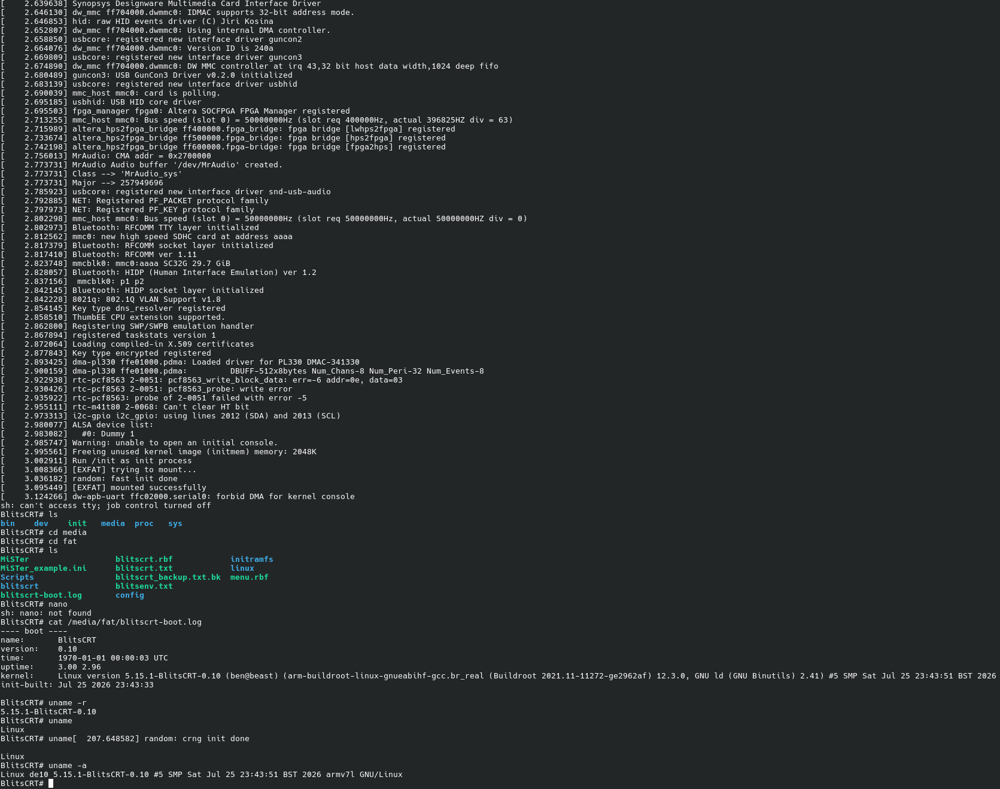

# blitsCRT_Mister

A 15kHz analog video card that enumerates over USB as a display.

It runs. 640x480i60 at a 15.750 kHz line rate, generated by the fabric and
locked onto by a real display. Colour bars, a mode readout and runtime mode
switching, out of the analog board and HDMI at the same time.

Both outputs carry the same pixel stream. Analog RGB666 goes out of the A/V
board's VGA connector for a CRT, and the same raster goes out of HDMI as Direct
Video. For SCART, set the `CSYNC` parameter and use a VGA-to-SCART lead.

The GUD device daemon in `sw/` is written and tested, and the fabric it drives
is built: register file, PLL with runtime reconfiguration, and the HPS bridge
that carries commands between them. What none of it has had yet is a power-on on
real hardware with a host attached.

**Status** below has the detail of what is done and what is not.

## Quick start

```
make setup      # 1. install the toolchain (cross-compiler, iverilog, dtc, git)
make world      # 2. build everything the installed tools allow
make sd DEST=/path/to/mounted/card      # 3. copy rbf + kernel to the card, then set the u-boot env
```

`make setup` is the first step: it installs the build dependencies through your
package manager and offers to clone a kernel tree. It does not install Quartus,
which is a manual licensed download — see **Prerequisites**. `make world` then
builds whatever it finds a toolchain for and skips the rest with a note naming
what is missing, so a partial toolchain still gets you a partial build rather
than an error. **Prerequisites** and **Build** have the detail.

## Lineage

This grew out of **BlitCRT** — <https://github.com/alphanu1/blitcrt> — my 15kHz
FPGA video card. It is a blit streamer: the host pushes damage rectangles
straight into live scanout over FT245. No present, no flip, nothing to double
buffer.

Before that I wrote MME4CRT, RetroArch's 15kHz support, and CRTPi.

**This is a blit streamer too.** The model is defined by the write path, not by
where the pixels live. BlitCRT keeps a 4bpp frame on-chip in block RAM and is
still a streamer, because rects go into live scanout and nothing is ever
presented or flipped. Same here.

GUD suits that. It is a damage-rect protocol: a cursor crossing a static screen
costs a few hundred bytes instead of a megabyte, and there is no frame
submission step anywhere in it.

What changes is how much scanout memory the write path needs, and this board has
far more of it than the Cyclone IV BlitCRT runs on. See **Scanout memory** below
for where the pixels go. M3 is the plumbing, not a change of model.

Target is the MiSTer Pi (Cyclone V SE 5CSEBA6U23I7) with the analog A/V board.
A DE10-Nano works identically.


*Work in progress. The fabric running on a MiSTer Pi, mode 1 at 640x480i60,
out of HDMI as Direct Video. The overlay is reading its own timing back: 15.750
kHz line rate, 12.600 MHz pixel clock, and the porch numbers the timing
generator was handed.*

*This shot predates the current banner text, which spells out that the vertical
values are per field and gives the totals. The photograph is otherwise what the
hardware does.*


*The same thing moving.*

[Full clip, 640x480i60 out of HDMI](docs/video/runtime_m1.mp4)

Below is the same design rendered from simulation, one pixel at a time straight
out of the datapath:


## The goal

A blit streamer that a Linux host treats as an ordinary display, driving a
15kHz CRT with no emulator in the path.

The device implements GUD (Generic USB Display). On any Linux machine it
enumerates as a `drm_device` — a real `/dev/dri/card*`. Nothing on the host
knows or cares that the panel is a CRT hung off an FPGA. You can drag a window
onto it, run a native Linux arcade port, or point Wayland at it, and the pixels
come out at 15kHz. That is the whole point: the CRT stops being tied to an
emulator pipeline and becomes a display the OS can use for anything.

This is a different approach from the emulator-driven path. There, a guest has
to run something like GroovyMAME with exact modelines and beam-timed updates to
push frames. Here the work happens at the kernel driver layer on the host, and
GUD's damage-rectangle model means only changed pixels cross the wire. The
device takes those rectangles into scanout memory and reads them out as a 15kHz
raster.

A few specifics, since they are easy to assume wrong:

- **No compression on the wire, for now.** GUD can negotiate LZ4 and the device
  declines it. The 15kHz modes fit raw even full-frame: 640x240 RGB888 at 60 Hz
  is 27 MB/s and 480i RGB565 is 18 MB/s, both inside USB 2.0's ~35 MB/s of bulk,
  and damage rectangles cut the real figure well below that. Compression earns
  its place only at the higher line rates — see **M5**.
- **The transport is the general-purpose HPS port, not AXI or DMA.** Register
  and pixel access marshals through the 32-bit `gp` interface the board already
  brings out. The seam that carries it (`rtl/blitscrt_bridge.v`) can be switched
  to the lightweight AXI bridge with one parameter, but the built path is the
  simpler gp one.
- **It is a blit streamer, not a line-by-line transceiver with no memory.** The
  device holds scanout memory; the raster reads from it on the pixel clock while
  the host writes into it whenever it likes. See **Lineage** for why that
  storage is required and why it is still a streamer.

The host does the rendering. The board is a USB-to-CRT display that happens to
be an FPGA.

## Relationship to MiSTer

blitsCRT_Mister is not a MiSTer core. It does not use the MiSTer framework,
`hps_io`, the OSD, or the MiSTer menu, and it does not run any MiSTer core. It
runs its **own** kernel on the MiSTer hardware.

What it borrows from a MiSTer card is the low-level boot: the A2 preloader (which
brings up DDR3 and the HPS pin mux) and the u-boot binary. Above that, BlitsCRT
replaces the environment entirely. u-boot is repointed to program `blitscrt.rbf`
onto the fabric and boot the BlitsCRT kernel directly, with no menu, no `.rbf`
hand-off, and no MiSTer Linux. It is a **dedicated boot**: this card powers
straight into BlitsCRT.

Because the kernel is ours, the USB OTG port can be put in peripheral mode, which
the GUD host link needs and which the stock MiSTer kernel, being USB-host only,
cannot do.

The boot procedure is in **Bringing up the HPS side** below.

## What it does

- Analog RGB666 out of the A/V board. The same stream out of HDMI as Direct Video
- Eight-bar colour test card, half-amplitude bars, 16-step greyscale ramp,
  one-pixel border, centre crosshair
- Idle screen giving mode, line rate, pixel clock, porch numbers, host status
  and which outputs are live
- `BTN_OSD` cycles the mode. `BTN_USER` hides the overlay. `BTN_RESET` resets
  the video pipeline

### Modes

Modes are dynamic. The point of the whole thing is that the host names a
timing and the board produces it, which is how Switchres works: a modeline per
game, arbitrary pixel clocks, nothing fixed in advance.

The software side already does this. `sw/modes.c` takes any DRM mode a host
hands over, checks it against what a 15kHz CRT will survive, and `sw/pll.c`
solves the PLL counters for the clock. Worst case across real console and
arcade timings is 6 ppm. The mode list itself is dynamic too: modes can be
added at runtime and the host re-reads them without re-enumerating the USB
device.

### What the daemon advertises

Four modes, with 640x480i60 first and flagged `PREFERRED`, which is what a host
picks on first connect.

| mode | pixel clock | line | field | |
|---|---|---|---|---|
| **640x480i60** | 12.600 MHz | 15.750 kHz | 60.00 Hz | preferred, NTSC 480i |
| 640x576i50 | 12.500 MHz | 15.625 kHz | 50.00 Hz | PAL 576i |
| 320x240p60 | 6.300 MHz | 15.750 kHz | 60.11 Hz | NTSC 240p |
| 320x288p50 | 6.250 MHz | 15.625 kHz | 50.08 Hz | PAL 288p |

Each 320-wide mode is exactly half its 640-wide partner, and the counters fall
out of the same VCO:

```
640x480i60   12.600 MHz   VCO 1575   C=125      NTSC pair
320x240p60    6.300 MHz   VCO 1575   C=250
640x576i50   12.500 MHz   VCO  800   C=64       PAL pair
320x288p50    6.250 MHz   VCO  800   C=128
```

Two VCOs cover all four, and within a VCO the 640 and 320 modes are one counter
apart. All four solve to 0 ppm. That shapes the M2 PLL work: reconfigure M and N
to swap VCO between NTSC and PAL, and take the two C outputs into the clock mux
for 640-wide against 320-wide. Two muxed PLL outputs is exactly what
`altclkctrl` allows.

This is the advertised list, not a limit. A host can set a timing that was never
in it, which is the Switchres case.

What the fabric ships with today is three built-in modes, because it has two
fixed pixel clocks until `altera_pll_reconfig` lands:

| | mode | pixel clock | line | field | for |
|---|---|---|---|---|---|
| 0 | 640x240p60 | 12.600 MHz | 15.750 kHz | 60.11 Hz | 15kHz CRT |
| 1 | 640x480i60 | 12.600 MHz | 15.750 kHz | 60.00 Hz | 15kHz CRT, standard 480i |
| 2 | 640x480p60 | 25.200 MHz | 31.500 kHz | 60.00 Hz | any VGA or HDMI display |

Modes 0 and 1 share a clock. Switching between them never touches the PLL.

The timing generator itself has no built-in modes. Porches, active size and the
interlace flag are all inputs, latched while the pipeline is held in reset. It
will drive whatever timing it is given. Only the clock is pinned.

## The write path

The host does not send frames. GUD is a damage-rect protocol: after
`GUD_REQ_SET_BUFFER` names a rectangle, a bulk transfer carries only the pixels
inside it. A cursor moving across a static screen costs a few hundred bytes,
not a megabyte.

Rects land in scanout memory and the raster reads from it. There is no present
and no flip; the write path goes straight at the picture. GUD's kernel header
happens to call that region a framebuffer, but nothing in the protocol submits
a frame.

### Pixel formats

The A/V board is a six-bit resistor ladder per channel. **RGB666** is what
actually reaches the CRT. HDMI carries the same pixels widened to RGB888 by
replicating the top bits.

GUD has no RGB666 format and no indexed format either. The 4bpp palette idea
from BlitCRT does not map onto it at all. Three formats are offered:

| format | bytes/px | reaches the DAC as | note |
|---|---|---|---|
| **RGB888** | 3 | full 6/6/6 | truncated to the ladder, nothing wasted |
| RGB565 | 2 | 5/6/5 into 6/6/6 | gives up a bit on red and blue, halves the bandwidth |
| RGB332 | 1 | 3/3/2 into 6/6/6 | for tight bandwidth |

RGB888 is listed first because it uses the whole ladder.

### Scanout memory

Three tiers are available on this board, which is a different situation from the
Cyclone IV BlitCRT was built on.

| | size | notes |
|---|---|---|
| **M10K on-chip** | ~696 KB | no controller, lowest latency, no arbitration |
| **SDRAM module** | 128 MB | optional add-on, fabric-side, 16-bit |
| **HPS DDR3** | 1 GB | always fitted, reached over the f2sdram bridge |

What fits on-chip, leaving headroom for the rest of the design:

| mode | RGB332 | RGB565 | RGB888 |
|---|---|---|---|
| 640x240p60 | 150 KB, double-buffered | 300 KB, single | 450 KB, single |
| 640x480i60 | 300 KB, single | 600 KB, off-chip | 900 KB, off-chip |
| 640x480p60 | 300 KB, single | 600 KB, off-chip | 900 KB, off-chip |

The 240p modes run entirely from block RAM. That is worth having: no controller,
no refresh, no arbitration between host writes and the raster, and a scanout
read that cannot be late.

Everything above that goes off-chip, either to the SDRAM module if it is fitted
or to HPS DDR3 over f2sdram if it is not. DDR3 is the more interesting target —
it is always present, it is 1 GB, and the latency is absorbed by a line FIFO in
front of scanout. Capacity stops being a consideration at either.

Bandwidth is the reason RGB565 stays on the list. A full 640x480 frame in RGB888
at 60Hz is 55 MB/s, past what USB 2.0 bulk will carry. Damage rects mean that
ceiling is rarely approached, and the 15kHz modes sit well inside it: 640x240 in
RGB888 at 60Hz is 27 MB/s full-frame.

## What the screen tells you at boot

The board can be in three states, and the overlay distinguishes them so a dark
or wrong screen points at the right layer.

**Fabric only.** The FPGA is programmed and drawing the test card, but the HPS
is silent: Linux has not booted, or `blitscrtd` is not running. The overlay
shows a dedicated banner naming that state. This is the screen you get from
u-boot loading the `.rbf` with nothing else up.

**HPS up, no host.** The daemon is running and its heartbeat is fresh, but no
PC has enumerated the USB gadget. The overlay is the daemon's live one, with a
`USB NO HOST` line. Linux booting has nothing to do with a host being attached;
the board runs fine with the cable unplugged.

**Streaming.** A host is attached and pixels are arriving.

The mechanism is a heartbeat register the daemon bumps a few times a second and
a watchdog in the fabric that counts fields since it last changed. Past about a
second and a half of silence the fabric declares the HPS down and falls back to
its own baked banner. When the daemon is alive its text wins. The daemon also
writes a host-status hint, since only it knows the USB state.

The heartbeat is why the gadget loop polls with a timeout instead of blocking
on USB events: it has to keep ticking while idle, or the fabric would decide the
daemon had died every time no host was attached.

## Modes and how one is picked

Every mode goes out **both connectors at once**. `VGA_R/G/B` and `HDMI_TX_D`
come off the same pixel stream. There is no such thing as a per-output mode.
The only difference between the two paths is that the analog pins are released
rather than driven when the A/V board is not fitted.

**640x480i60 is the default.** It is a standard SD format. An HDMI sink takes it
where it would refuse 640x240p, and a 15kHz CRT is happy with it either way. I picked it as the mode most likely to give a picture on whatever is
plugged in.

At reset the mode follows what is fitted: the analog board picks `DEFAULT_VGA`,
otherwise `DEFAULT_HDMI`. Both are 1. `BTN_OSD` cycles from there, since no
amount of detection can tell whether the cable past the connector is any good.
`LED_HDD` blinks the mode number. The running mode stays readable with no
picture and no serial console.

```
set_parameter -name DEFAULT_VGA  1    # analog board fitted
set_parameter -name DEFAULT_HDMI 1    # HDMI only
set_parameter -name FORCE_MODE   -1   # 0/1/2 pins one, ignoring detection
```

Drop `DEFAULT_VGA` to 0 for 240p once the analog path is known good. Setting
either to 2 comes up at 31kHz VGA timing, which needs no DAC at all.

**Mode 2 is there for diagnosis.** Standard VGA timing needs no DAC and no
SCART lead. If mode 0 is dark and mode 2 shows a picture, the fault is in the
cable, not the design.

### Why two clocks and not three

I wanted three. `altclkctrl` on Cyclone V only takes PLL outputs on two of its
four inputs; the other two want real clock pins, and Quartus is blunt about
it:

```
Error (15836): inclk[0] port of Clock Select Block is driven by ... altera_pll ...
but must be driven by a clock pin; PLL output clocks should be moved to inclk[2] or inclk[3]
```

So I arranged the three modes to need two clocks. 12.600 MHz carries both 15kHz
modes at the same 15.750 kHz line rate, and 25.200 MHz carries the 31kHz one.
Both counters hang off one VCO at 1260 MHz, C=100 and C=50 — a single PLL with
two outputs. Slots 0 and 1 of the mux go to the 50 MHz reference, which is a
clock pin and keeps Quartus happy.

The video pipeline is held in reset across a clock switch. Arbitrary Switchres
clocks need `altera_pll_reconfig`, which arrives with M2.

## The idle screen

This is what you get from power-on until a host turns up. Enough to work out
what is wrong without a serial cable:

```
BLITSCRT_MISTER
FABRIC  NO HPS YET

MODE   640X480I 60.00HZ
LINE   15.750 KHZ
PIXEL  12.600 MHZ
H 60/76/640/24   HTOTAL 800
V 3/16/240/3 PER FIELD  525 LINES

USB    NO HOST
OUT    VGA RGB666 + HDMI DV
```

`PER FIELD` on that line matters. Everything vertical is per field. An
interlaced mode therefore shows 240 active lines under a 480-line name. The
two fields interleave: 3+16+240+3 = 262 per field, and 2x262+1 = 525 frame
lines, the odd line carrying the interlace offset. Without the label it reads
as a contradiction.

`tools/gen_banner.py` computes every number from the same timing values the
mode table carries. The screen cannot claim something the fabric is not doing.

`banner.hex` holds four banks of 16 rows: one per mode, plus a fabric-only banner in bank 3 shown when the HPS heartbeat is stale. and the
overlay picks the bank from the live mode. I had it baking a single block at
first, which cheerfully reported mode 0's numbers no matter what was on screen
once the modes went runtime.

The text lives in `char_ram.v` and comes up with no software running. At M2 the
HPS gets a write port onto the same buffer and the `USB` line becomes live
status.

Mode is a compile-time macro in M1. It becomes runtime in M2, once the HPS is in
the design and the PLL can be reconfigured.

## Layout

```
rtl/        the design
  blitscrt_top.v     top level, pad drivers, mode selection
  video_timing.v    15kHz timing, progressive and interlaced
  testcard.v        colour bars, ramp, border, crosshair
  overlay.v         8x8 text compositor
  char_ram.v        overlay character buffer (HPS write port lands here in M2)
  font_rom.v        8x8 font
  mode_table.v      the three modes, detection and button cycling
  blitscrt_regs.v   Avalon-MM register file and the bus/video clock crossing
  blitscrt_bridge.v the HPS-to-fabric seam, lightweight bridge or gp ports
  blitscrt_hps.v    the HPS general-purpose interface, isolated
  pll_modes.v       one PLL, two outputs, glitch-free mux
  adv7513_init.v    HDMI transmitter setup, Direct Video register table
  i2c_master.v      write-only I2C master feeding it
  font8x8.hex       generated
  banner.hex        generated
rtl/mister/ lifted from MiSTer, unmodified, GPL-2. sysmem_lite (the f2sdram
            path) and the safe terminator it instantiates. Kept apart so what is
            ours and what is theirs is never in doubt -- see its own README
sw/         GUD device daemon (M2 onward)
  gud.h             protocol, mirrored from the kernel header
  device.c          control requests, no USB in it
  modes.c           mode validation, DRM timing to fabric timing
  pll.c             Cyclone V counter search for arbitrary pixel clocks
  fabric.c          register access over the lightweight bridge
  gadget.c          FunctionFS transport
  blitscrt_regs.h   the fabric/software register contract
quartus/    project, pin assignments, constraints
sim/        testbenches and rendered output
tools/      font, banner, PNG and u-boot override generators
docs/       BRINGUP.md  step by step to first picture
            BOOT.md     how the bitstream reaches the FPGA
```

**Bringing it up for the first time: `docs/BRINGUP.md`.**

## Prerequisites

### Hardware

| | |
|---|---|
| Board | MiSTer Pi, or a DE10-Nano. Cyclone V SE 5CSEBA6U23I7 |
| Video | MiSTer analog A/V board |
| SD card | A MiSTer card for its A2 preloader and u-boot binary. BlitsCRT then repoints u-boot to boot its own kernel — a dedicated card, not a MiSTer install. Cards over 32 GB are exFAT |
| Display | A 15kHz CRT, plus a VGA-to-SCART cable from the A/V board, or an HDMI-to-VGA DAC or direct-video HDMI-to-SCART cable from HDMI |
| Optional | Micro-B USB cable for the UART console on the back panel |

### Software

The quickest path is `make setup`, which installs everything the package manager
can provide and offers to clone a kernel tree:

```
make setup           # install deps, offer to clone a kernel tree
make setup-dry       # show what it would install, change nothing
make get-toolchain   # download a prebuilt ARM cross-compiler (Bootlin)
make kernel-clone    # clone the MiSTer kernel tree (non-interactive)
```

It covers the testbench and render toolchain, the ARM cross-compiler, `dtc`, and
`git`, on Arch, Debian, Fedora, or openSUSE. Two things it cannot install, since
neither is a package: **Quartus Prime Lite** (a manual, licensed download — tick
the Cyclone V device family during install) and the **kernel tree** itself,
though it offers to clone one at the end.

The full list, if you would rather install by hand:

| | | |
|---|---|---|
| Quartus Prime Lite | required for the bitstream | Tested against 24.1. Cyclone V ticked during install. Not a package — install by hand |
| Python 3 | required | Generates `font8x8.hex` and `banner.hex`. A bare install is enough |
| Icarus Verilog | optional | Runs the testbenches |
| Pillow | optional | `make render` |
| ARM cross-compiler | for the kernel | Repo package on Debian/Fedora; a prebuilt tarball (Arm, Bootlin) on Arch. Auto-detected |
| dtc | for the kernel | Device tree compiler |
| git | for the kernel | To check a kernel tree out |
| A kernel tree | for the kernel | MiSTer's `Linux-Kernel_MiSTer` or a mainline `linux-socfpga` |

```
# Arch -- repo tools from pacman, cross-compiler as a prebuilt tarball (below):
sudo pacman -S iverilog python-pillow dtc git

# Debian -- everything from the repos:
sudo apt install iverilog python3-pil device-tree-compiler gcc-arm-linux-gnueabihf git
```

On Debian and Fedora the ARM Linux cross-compiler is a normal repo package. On
Arch it is not — and the AUR package builds the entire toolchain from source
(gcc, glibc, binutils), which is slow and fails easily. Use a **prebuilt
toolchain** instead: download one, extract it, put its `bin/` on `PATH`.

- Arm's GNU toolchain: <https://developer.arm.com/downloads/-/arm-gnu-toolchain-downloads>
  — pick the AArch32 hard-float target (`arm-none-linux-gnueabihf`).
- Bootlin: <https://toolchains.bootlin.com> — armv7-eabihf, glibc.

Or let the build fetch one for you:

```
make get-toolchain      # download + extract a Bootlin ARM toolchain
```

This pulls the Bootlin `armv7-eabihf glibc` stable build (a prebuilt tarball, no
compilation), verifies its checksum, and extracts it to `~/toolchains/`. The
build then auto-detects it there — no `PATH` edit needed — or add its printed
`bin/` to `PATH` to use it in other projects. Its triplet is
`arm-buildroot-linux-gnueabihf-`, already in the auto-detect list.

It is a separate command from `make setup`, and on purpose: it downloads ~150 MB
from a third-party server and drops a toolchain on disk, which should be a
deliberate choice rather than a side effect of installing packages. `make setup`
installs the small repo tools and points you here for the compiler. Either way
the kernel step skips until a compiler is found — the fabric build never needs
one.

The stable build is chosen over bleeding-edge because its older kernel headers
are the safer match: a toolchain's headers version wants to be no newer than the
kernel you build against, and the MiSTer SoC kernel is not new.

`make tools` reports what is present:

```
python3    Python 3.13.7
iverilog   /usr/bin/iverilog
Pillow     present
quartus_sh /home/you/intelFPGA_lite/24.1std/quartus/bin/quartus_sh
```

Quartus does not add itself to PATH when it installs. `make quartus-path`
locates it and prints the `export PATH=` line.

If a compile stops with a device error, Cyclone V was not selected during
install. Check with:

```
ls ~/intelFPGA_lite/*/quartus/common/devinfo/
```

`cyclonev` must appear in that list.

## Build

```
make world      # everything: assets, testbenches, renders, bitstream, kernel, build set, manifest
```

Steps whose tool is missing are skipped instead of fatal, and the manifest at
the end lists every output with its path and size. That is the single command
if you want the lot.

The individual targets:

```
make              # assets, then the testbenches if Icarus is present
make assets       # just the generated .hex files Quartus reads
make sim          # timing and I2C testbenches
make lint         # elaborate the real top level against primitive stubs
make check-pins   # every port has a pin, and the pins match MiSTer
make check-decl   # no identifier used before it is declared
make check-ip     # generated PLL megafunctions carry the right settings
make render       # render a 640x240p60 frame from the RTL to PNG
make render-i     # same for 640x480i60
make bitstream    # find quartus_sh and compile, and generate the u-boot override
make kernel-config          # apply defconfig and merge the gadget fragment
make linux                  # configure, build, and stage the kernel + dtb
make build        # stage a bootable set (.rbf, .txt, kernel) into build/
make uboot-txt    # just the u-boot override
make quartus-path # locate Quartus and print the export PATH line
make preview      # self-contained HTML of this README, video playable
make manifest     # list every output and whether it exists
make tools        # report which tools are installed
make sd DEST=     # copy bitstream + BlitsCRT kernel to a mounted card
make clean        # remove all transient build products (safe if none exist)
make distclean    # also remove generated assets and the Quartus output
```

`make check-decl` catches identifiers used before they are declared. Icarus
builds disagree about whether that is legal, and Quartus never objects. It
surfaces as a build failure on someone else's machine. It has caught this twice.

`make check-pins` is the one worth running after any change to the top-level
port list. A port with no location assignment gets auto-placed by the Fitter
onto an arbitrary ball. `make world` runs it first for that reason.

```
make check-pins MISTER=/path/to/Template_MiSTer   # also cross-check the pins
make bitstream QUARTUS_SH=/path/to/quartus_sh     # force a Quartus install
```

`make preview` renders this file to a single HTML with every image, GIF and
video inlined as a data URI. It also turns the `.mp4` link below the runtime
clip into a real `<video>` element. GitHub strips `<video>` out of markdown. On
GitHub that line is a download link and the GIF is what moves; the preview plays
it properly.

Only the generated assets are required before Quartus. Icarus Verilog and
Pillow are verification tools; the bitstream does not depend on either.

### Quartus version

No version is pinned. The only requirement is a Quartus that carries Cyclone V
device support, which covers Prime Lite from 15.1 through 24.1 at least.
Nothing in the design depends on a particular release. Built and tested on
24.1std.

The 17.0.2 that MiSTer pins itself to is a convention for cores built on their
framework. Nothing here uses it.

```
make bitstream
```

Quartus does not put itself on PATH when it installs. The lookup checks PATH
first, then `/opt/intelFPGA_lite`, `/opt/intelFPGA`, `/opt/altera` and the same
three under `$HOME`, matching any version directory. With several installed it
takes the newest by version sort. Force a particular one with:

```
make bitstream QUARTUS_SH=/path/to/quartus_sh
```

`make quartus-path` reports which it found, how many are installed, and the
`export PATH=` line if you would rather set it yourself.

Two version-sensitive things, both with a fix in `docs/BRINGUP.md`: the device
family must have been ticked at install time, and a newer Quartus may refuse
`altddio_out`, which the `HDMI_CLK_DIRECT` macro works around.

For the interlaced build, uncomment the `MODE_640x480i` macro in
`quartus/blitscrt.qsf` and regenerate the banner:

```
python3 tools/gen_banner.py rtl/banner.hex 640x480i60
```

## Where things land

### The build set

`make world` builds everything its toolchains allow and ends by staging the
build set. Both the Quartus install and the kernel tree are auto-detected the
same way: if Quartus is on the path or in a standard install location the
bitstream builds, and if a configured kernel tree sits in a usual place
(`~/source/linux-socfpga`, `~/source/Linux-Kernel_MiSTer`, and similar) the
kernel builds — no flags. Point `KERNEL_SRC=...` at a tree elsewhere to override.
`make build` stages on its own. Either gathers what the board loads at power-on
into `build/`, laid out to mirror the SD card:

- `blitscrt.rbf` — the FPGA bitstream, if `make bitstream` has produced one
- `blitscrt/zImage` and `blitscrt/blitscrt.dtb` — the BlitsCRT kernel (with the
  initramfs embedded) and its device tree, if a kernel tree was found or
  `make linux` has built them, in the `blitscrt/` subfolder the boot env loads from
- `blitscrt/gadget-setup.sh` and `blitscrt/blitscrt_gadget.config` — the runtime
  USB setup and kernel options, for the GUD gadget
- `blitscrt.txt` — a generated u-boot override, retained but no longer used: the
  boot now repoints u-boot's saved environment (`tools/blitsenv.txt`) instead of
  relying on the MiSTer menu hand-off

The `build/` tree mirrors the card: `.rbf` at the top, kernel and runtime files
under `blitscrt/`. Copy its contents to the card root, then set the u-boot
environment once (see **Bringing up the HPS side**) and the board boots straight
into BlitsCRT.

`make bitstream` runs this automatically once it has produced a `.rbf`. A
successful compile leaves `build/` ready without a second command. Running
`make build` on its own stages whatever is present.

Pieces whose toolchain is absent are reported, not faked: without Quartus there
is no `.rbf`, without a kernel tree no `zImage`, and `make build` says so rather
than staging a half-set silently.

## Bringing up the HPS side

BlitsCRT boots its own kernel. The old model, selecting the `.rbf` from the
MiSTer menu and letting MiSTer's u-boot hand off, is gone: this card boots
straight into BlitsCRT.

### The BlitsCRT kernel

`make world` builds a branded kernel from the MiSTer kernel tree: a `zImage` with
an embedded initramfs, plus the device tree, versioned `BlitsCRT-0.10`
(`LOCALVERSION`, so `uname -r` reads `5.15.1-BlitsCRT-0.10`). The initramfs is a
single static `init` plus a static busybox, built into the image, so there is no
separate rootfs to ship. On boot `init` brings up `/proc`, `/sys` and `devtmpfs`,
mounts the card (exFAT on cards over 32 GB, FAT32 below), appends a stamped record
to `/media/fat/blitscrt-boot.log`, and drops to a busybox shell on the serial
console.

The kernel options beyond the base config live in `linux/blitscrt_boot.config`
(embedded initramfs, exFAT and FAT, the DesignWare SD/MMC driver, the HPS UART
console) and `linux/blitscrt_gadget.config` (dwc2 dual-role, FunctionFS, configfs
-- the USB-gadget stack the GUD link needs).

### Proof of concept: the kernel boots

Confirmed on hardware. The custom u-boot env programs the fabric, boots
BlitsCRT-0.10, the initramfs mounts the exFAT card, and the boot log is written by
our own kernel:



### The boot set

`make world` stages, under `build/`, everything the card needs:

| file | on the card | what it is |
|---|---|---|
| `blitscrt.rbf` | `/blitscrt.rbf` | the fabric bitstream, programmed by u-boot |
| `zImage` | `/blitscrt/zImage` | the BlitsCRT kernel, initramfs embedded |
| `blitscrt.dtb` | `/blitscrt/blitscrt.dtb` | the device tree |
| `blitsenv.txt` | imported into u-boot | the u-boot environment (below) |

`make sd DEST=/path/to/mounted/card` copies the first three to the card root. The
card's FAT/exFAT partition also carries the MiSTer preloader and u-boot that the
A2 boot chain needs.

### The u-boot environment

The one non-file step. BlitsCRT boots by pointing u-boot's saved environment at
our kernel instead of MiSTer's. `tools/blitsenv.txt` is that environment:

```
core=blitscrt.rbf
bootcmd=... run fpgaload; load ... blitscrt/zImage; load ... blitscrt/blitscrt.dtb; ... bootz 0x01000000 - 0x03000000
```

`run fpgaload` is MiSTer u-boot's own routine -- it loads `blitscrt.rbf` and
`fpga load`s it into the fabric -- now pointed at our core; then the kernel and
device tree load and `bootz` starts BlitsCRT. The initramfs is inside the
`zImage`, so there is no `root=`. The kernel loads at `0x01000000` and the dtb at
`0x03000000`, a 32 MB gap that keeps the growing kernel image clear of the dtb.

Install it once from the u-boot serial console. This is a **dedicated card** -- it
replaces MiSTer's boot on it, so back up first:

```
load mmc 0:1 0x01000000 blitsenv.txt
env import -t 0x01000000 $filesize
saveenv
reset
```

Break into u-boot by holding a key at power-on (bootdelay is 0). u-boot stores its
environment in the MMC (offset 512), so `saveenv` persists it with no u-boot
rebuild. After that the card boots straight into BlitsCRT on every power-up.

Watch it on the HPS UART at 115200: programming the fabric, the kernel boot, the
mount and the log all appear there.

## HDMI

The 15kHz stream goes out of the HDMI connector unscaled. An HDMI-to-VGA DAC or
a direct-video SCART cable converts it back to analog at the far end. The line
rate is untouched at 15.7 kHz.

Register `0x3B = 0x00` is what makes this work. It selects automatic pixel
repetition, and the ADV7513 then handles a pixel clock below its own minimum by
repeating internally. MiSTer sets the same value when `direct_video` is on.
`0xAF = 0x04` selects DVI mode, dropping infoframes that nothing downstream
reads.

MiSTer does this configuration in software. `sys_top.v` routes HDMI I2C to the
HPS and the MiSTer binary writes the registers from Linux. This fabric runs
with no software at all.
`adv7513_init.v` carries the same table and walks it over a fabric I2C master,
replaying about twice a second to catch a display plugged in later.

`LED_HDD` lights once the transmitter acks the whole table. If it stays dark the
I2C bus is not answering. Look at wiring and address before video.

`direct_video=1` in `MiSTer.ini` has no effect on this bitstream. The equivalent
is compiled in.

## Verified in simulation

Measured out of the RTL:

```
640x240p60    63.4928 us line -> 15.7498 kHz, 262 hsync/frame, 153600 pixels

640x480i60    63.4928 us line -> 15.7498 kHz, 33.3338 ms frame -> 29.9996 Hz
              525 hsync/frame, 307200 active pixels, xpos 0..639, ypos 0..479
              hsync jitter 0.000000 us over 1200 lines
              vsync-to-hsync gap: even field 0.0000 us, odd field 31.7464 us

640x480p60    31.7456 us line -> 31.5004 kHz, 16.6665 ms -> 60.0005 Hz
              525 hsync/frame, 307200 active pixels

ADV7513 init  47 transactions decoded off the bus, 0 errors
              device address byte 0x72, first 0x98=03, last 0xFA=7D

mode select   analog board fitted        -> 640x480i (default)
              BTN_OSD once, twice, wrap  -> 640x480p, 640x240p, 640x480i
              HDMI only, no analog board -> 640x480i

scanout       28 checks: RGB565/RGB888/XRGB8888/RGB332 unpack to RGB666,
              address generation, pixel and line replication, bounds clamp,
              and one-clock latency matching the test card
rect port     seek, one-per-word advance, readback, then a rect written from
              the bus domain appearing at the right raster coordinates and
              nowhere else; geometry staged and latched only on APPLY
line fetcher  18 checks against a memory model with latency and bubbles:
              base + y*stride, beat counts per format, burst splitting,
              column readback, no underrun
register map  the 0x1000 aperture cannot reach CTRL, H_SY or H_BP
```

Seven testbenches, plus four software test binaries covering the PLL solver, the
reconfiguration sequence, the mode list and the GUD request handling. `make lint`
elaborates both scanout configurations; `make check-clk`, `check-pins`,
`check-decl`, `check-ip` and `check-fit` catch the classes of mistake that
otherwise reach hardware silently.

The last vsync line is the interlace check. hsync free-runs and only vsync
moves. That half-line shift is what drops the CRT raster to interleave the
fields.

PNGs in `sim/` are captured from the datapath during simulation. The interlaced
frame is both fields woven together:


## Notes on the hardware

VGA on the analog A/V board is a six-bit resistor ladder per channel wired
straight to FPGA pins. There is no DAC chip in the path. The design outputs
RGB666 natively.

Pin assignments in `quartus/pins.tcl` come from the MiSTer framework's `sys.tcl`
and `sys_analog.tcl`. They describe board wiring.

`make check-pins` verifies that every port on `blitscrt_top` has a location
assignment. A port without one gets auto-placed by the Fitter onto an arbitrary
ball, which is how a design ends up with its clock on the wrong pin and no
picture. It runs as part of `make world`.

Point it at a MiSTer checkout to cross-check the assignments themselves:

```
make check-pins MISTER=/path/to/Template_MiSTer
```

Last run against MiSTer master:

```
blitscrt_top ports:      59
active pin assignments:  59
commented out (for M3):  39

PASS  every port has a location assignment

cross-check against MiSTer (145 reference assignments):
  compared  98
  mismatch  0
  not in reference  0
```

The 39 commented assignments are the SDRAM module, verified against the same
reference and ready for M3. The 47 MiSTer signals with no counterpart here are
audio, SDIO, the ADC, the user IO header and the DE10-Nano's own LEDs and
switches, none of which this design touches.

These assignments describe the DE10-Nano with the official I/O board. They hold
on the MiSTer Pi with the A/V Pro because MiSTer cores run there unmodified,
and every signal used here is actively driven or read by `sys_top.v` — the
clock, all three colour channels, both syncs, the board detect, the LEDs, the
buttons, the whole HDMI bus and its I2C. Working cores exercise every one of
them.

The one thing that departs from MiSTer is what drives HDMI I2C. `sys_top.v`
routes those two pins to the HPS and configures the ADV7513 from Linux.
`adv7513_init.v` drives the same pins from fabric instead. They are FPGA I/O
either way and the pad behaviour is identical. What is new here is the I2C
master and the register table. `LED_HDD` reports whether the transmitter acked
it.

`VGA_EN` is an input with a weak pull-up. The A/V board pulls it low. With no
board fitted the VGA pins are released. Check that pin first on a dark screen.

Sync is driven active low for 15kHz RGB and SCART. The `CSYNC` parameter on
`blitscrt_top` puts composite sync on the HS pin for SCART pin 20.

The pixel pipeline is five clocks deep from the raw counters and sync is delayed
to match. An error here shifts the picture within the active window and moves
the porches the CRT centres on.

Unused pins are reserved as tri-stated inputs. The design cannot drive the
SDRAM, the HPS GPIO, or anything else it has no assignment for.

## The GUD daemon

`sw/` holds the device side of the Generic USB Display protocol. It answers
every control request, validates modes against what a 15kHz CRT will survive,
and solves PLL counters for pixel clocks it has never seen.

```
cd sw
make test                                # no hardware needed
make CROSS_COMPILE=arm-linux-gnueabihf-  # for the target
```

The protocol layer has no USB in it. The whole control surface runs under
test:

```
worst error 6 ppm, worst search 3026 candidate evaluations     test_pll
counter encoding round-trips across every divide to 510        test_pll_reconfig
12 modelines validated or correctly refused                    test_modes
33 assertions: enumeration, modeset, flush, dynamic modes      test_device
```

### PLL reconfiguration

Counters are not written as divide values. Each splits into a high and a low
half-period so an odd divide can hold one phase a cycle longer:

```
divide 1     bypass the counter
divide even  high = low = D/2,          odd_duty = 0
divide odd   high = (D+1)/2, low = D/2, odd_duty = 1
```

Both halves are eight-bit fields, which caps any divide at 510 rather than the
512 the datasheet quotes for the counters themselves. `pll_cyclonev` in
`sw/pll.c` carries the same ceiling, because solving for a divide the hardware
cannot be told about is worse than not solving. The test found that: 511
encoded as high=255+1 and wrapped silently.

### Dynamic resolutions

Switchres generates a modeline per game. A fixed list will not do, and two
paths are covered:

- **Adding to the list.** `blitscrt_modelist_add()` validates and appends, then
  raises `GUD_CONNECTOR_STATUS_CHANGED`. The host re-probes the connector and
  re-reads the modes. No USB re-enumeration, which would tear down the DRM
  device and every client's framebuffer with it.
- **Setting an unadvertised mode.** DRM lets userspace set a timing that was
  never probed. `GUD_REQ_SET_STATE_CHECK` carries the full mode, and the device
  is the arbiter. `test_device` sets a 384x224 modeline that was never in the
  list and it is accepted, validated and clocked.

Refusing matters as much as accepting. A 640x480p60 mode at 31.5kHz gets
stalled with `GUD_STATUS_INVALID_PARAMETER` and the previous mode stays live.
Sending 31kHz to a 15kHz set is a repair bill.

### Register file

`rtl/blitscrt_regs.v` implements the map in `sw/blitscrt_regs.h` as an
Avalon-MM slave in the 50 MHz bus domain, with the video side on whatever the
pixel clock currently is. Two crossings live in it.

Timing moves as a **block**, not register by register. Writing `APPLY` toggles a
request; the video side latches all nine values at the next vblank and
acknowledges. A modeset therefore cannot land half-applied, and cannot tear.
`STATUS` carries an `APPLYING` bit so software can tell the difference between
"queued" and "live".

Status comes back through two-flop synchronisers, which is enough for bits
nothing sequences on.

```
0x0000..0x0FFF  registers
0x1000..0x1FFF  altera_pll_reconfig
0x2000..0x3FFF  character buffer, one byte per word
```

### Register contract

`sw/blitscrt_regs.h` is the interface between the daemon and the fabric.
Timing registers use the same four-part decomposition the RTL is parameterised
with, and `test_device` asserts that a DRM `640x240p60` mode converts to
exactly the `H 30/32/320/24 V 3/16/240/3` compiled into `blitscrt_top.v`.

Timing and PLL values are staged and latched together on a vblank. A modeset
never shows a partial frame at a half-applied timing.

## Status

**M1 -- fabric only. Done.** Running on hardware: 15kHz output, both connectors
live.

| | |
|---|---|
| **done** | **15kHz confirmed on hardware: 640x480i60 at 15.750 kHz, over HDMI** |
| done | 15kHz timing, progressive and interlaced, measured out of the RTL |
| done | three built-in modes, runtime selection, detection, button cycling |
| done | timing generator takes porches and geometry as inputs, not parameters |
| done | test card, text overlay, font and banner generation |
| done | ADV7513 setup over a fabric I2C master, 47 writes decoded |
| done | pin assignments verified against MiSTer, every port covered |
| done | analog RGB666 and HDMI driven from the same pixel stream |

**M2 -- custom kernel and runtime control. Done.** The BlitsCRT kernel boots on
hardware, the daemon reads and drives the fabric over the gp transport, and the
live overlay -- mode, line and pixel rates read back from the register block, with
an HPS-up heartbeat holding it on screen -- is running.


| | |
|---|---|
| **done** | **daemon reads `fabric v2.1` over gp, runs the heartbeat, drives the live overlay on hardware** |
| done | BlitsCRT-0.10 kernel boots, mounts the card, writes the boot log |
| done | dedicated u-boot boot: env programs the fabric and boots our kernel |
| done | embedded initramfs: static init + busybox, exFAT/FAT mount, serial shell |
| done | init launches `blitscrtd --no-gadget` on boot |
| done | gp bridge: read-latency, 32-bit half-select, and strobe CDC, verified in `tb_bridge` |
| done | `blitscrt-peek` register tool for bring-up (read / write / beat) |
| done | Avalon-MM register slave `rtl/blitscrt_regs.v`, PLL and reconfig IP wired in |
| done | clock crossing: timing latched as a block on vblank, status resynced |
| done | heartbeat watchdog and host-state hint; `hps_alive` drives the overlay bank |
| done | GUD control endpoint (15 requests), mode validation, PLL solver (6 ppm worst case) |
| done | gadget stack built into the kernel (dwc2 dual-role, FunctionFS, configfs) -- for M4 |

Bringing the transport up on hardware turned up three bugs, all now fixed in
`rtl/blitscrt_bridge.v` and covered by `sim/tb_bridge.v`: the bridge captured the
registered slave's read data a cycle early (a one-transaction lag); it never moved
more than 16 bits, so the 32-bit `BCRT` ID read back half-shifted; and it sampled
the asynchronous gp strobe without synchronising it, dropping the odd transfer.
With those fixed the daemon reads the register block cleanly both ways -- confirmed
with `blitscrt-peek` -- runs the heartbeat, and `hps_alive` latches, switching the
overlay from the fabric's baked banner to the daemon's live text.

The daemon writes its banner into all three overlay banks so it shows whatever
mode the front panel has selected, and reports the fabric's actual timing read
back from the registers. `blitscrt_fabric_open()` is the seam; the daemon builds
static for ARM and runs from the initramfs, or from a swappable copy on the card.

**M3 -- scanout memory. Done, with one outstanding bug.** Split into three, because the
pixel path and the memory it lands in are separate problems.

*M3a -- the scanout pipeline.* Done, confirmed on hardware. `rtl/scanout.v` reads
scanout memory and unpacks RGB565, RGB888, XRGB8888 and RGB332 to RGB666, and
`rtl/scanout_ram.v` holds it in on-chip M10K, 320x240 at one 16-bit word per pixel
for 1.2 Mbit of the 5.57 Mbit available. The source mux in `blitscrt_top` picks
between the test card and scanout off `CTRL`, and the control bits that were left
unconnected through M2 -- `ENABLE`, `TESTCARD`, `OVERLAY`, `CSYNC`, `HDMI_EN` --
are live. Reset defaults reproduce M1/M2 behaviour exactly, so nothing changes
until something writes `CTRL`.

Scanout costs exactly one clock from `xpos` to RGB, which is what the test card
costs, so the mux is transparent and the five-deep sync alignment is untouched.
`sim/tb_scanout.v` holds that to account: 28 checks over the unpack, the address
generation, replication and the bounds clamp. Memory comes up holding
`tools/gen_scanout_test.py`'s pattern -- a gradient, a diagonal, a grid and corner
patches, chosen so an address or stride mistake is visible rather than merely
wrong -- so the read path can be proved before any write path exists. `make
render-scanout` puts it through the real overlay and out to PNG.

Replication comes out of the geometry rather than a register bit: memory half the
width of the active area is pixel-doubled, half the height line-doubled. That is
what gets a true 320-wide active area back after the design dropped to two pixel
clocks, and it covers 480i from 240 lines.

*M3b -- the rect write port.* Done in simulation, not yet run on hardware.
Scanout memory is 76800 pixels against a 14-bit bus address, so it cannot be
mapped into the register window the way the character buffer is. It is reached
through an auto-incrementing pointer instead, which is the shape a damage
rectangle wants anyway: `SCANOUT_WADDR` seeks, `SCANOUT_WDATA` takes one pixel and
the pointer follows, so a run of consecutive pixels costs no address traffic
between them.

`WDATA` is 16 bits wide on purpose. The gp bridge issues a complete bus write off
a single low-half command, so a 16-bit register costs one command per pixel where
a 32-bit one costs two -- the difference between a full 320x240 repaint taking
77 ms and 150 ms. One command per pixel is the floor this transport allows.

`sw/fabric.c` grows the rect surface: `blitscrt_scanout_blit()` and
`_fill()` take x/y/w/h, seek once per row, clip to whatever memory is fitted, and
report what actually landed. Geometry is not assumed -- `SCANOUT_GEOM` reports it
and the daemon reads it at open, because it will be something else entirely once
memory moves off-chip. `WADDR` reads back, so counting what landed is one register
read.

`sim/tb_scanout_write.v` covers both halves: that the pointer seeks, advances by
exactly one per word and reads back, and then the whole path -- bus domain,
through memory, into the pixel domain -- writing a rect over a known background
and checking it appears at the right raster coordinates and nowhere else.

`blitscrt-peek -f <x> <y> <w> <h> <rgb565>` fills a rect and times it. That is
also the first real measurement of gp throughput, since one command per pixel
makes pixels/second the transport's ceiling -- the number that decides whether
M3c is optional or mandatory.

*M3c -- HPS DDR3 over f2sdram.* Done. The datapath is confirmed on hardware.

Scanout memory moves off-chip, which removes the geometry ceiling entirely --
640x480 RGB565 is 600 KB, impossible in M10K and nothing in DDR3. It is also the
cheaper path, not merely the bigger one: pixels arriving over USB are already in
DDR3, so the fabric goes to them rather than software pushing every pixel across
a bridge. Measured on hardware, the ARM writes that window at 110 MB/s by memcpy
against USB 2.0's ~35 MB/s ceiling, so the host-side copy stops being a limit.
Row-granular copies cost nothing against one large one, so a narrow damage rect
is not penalised.

`rtl/scanout_fetch.v` bursts one line into a double-buffered line buffer while
the raster reads the other. The buffers hold raw bus beats and lane selection
happens on the read side, so the fetch path is entirely format-agnostic -- it
moves bytes and never learns what a pixel is. Double buffering is not for
throughput; a line is 1280 bytes against 63.5 us and the margin is roughly
fortyfold. It is there so a late burst cannot swap a buffer under the raster,
which would tear rather than merely slow.

`rtl/blitscrt_f2sdram.v` is the seam, and `rtl/mister/sysmem.sv` is MiSTer's,
lifted whole. It turned out not to be a Platform Designer project at all but a
flattened system checked in as SystemVerilog, so there is nothing to generate.
Using theirs is not only convenience: the f2sdram port configuration is latched
by `APPLYCFG` while the SDRAM interface is idle, which the preloader does at boot
and Linux cannot do at all, so a different configuration would not match what is
already latched. The adapter exists for two things -- the port is word-addressed,
so a byte address shifts right by three, and burstcount narrows to eight bits.

`SCANOUT_SRC` picks where pixels live, in the same spirit as `BRIDGE` on
`blitscrt_bridge`: one place knows and nothing downstream changes. `scanout.v` is
identical either way. Only one memory is instantiated, so a DDR3 build gets the
43% of M10K back that the on-chip picture was using.

Software reads what it is talking to rather than assuming. `CAPS` says which
scanout source the bitstream has, because the two need different write paths and
choosing wrong fails silently -- rect writes on a DDR3 build land in a register
nothing is listening to. `SCANOUT_GEOM` is writable and latches with the timing
set, so geometry is no longer a compile-time fact. `SCANOUT_DIAG` reports beats
moved for the last line and a saturating underrun count, which turns a wrong
picture into one register read: zero beats is the port not answering, non-zero
underruns is the fetcher falling behind, and neither is distinguishable from the
other by looking at the screen.

`blitscrt_scanout_configure()` sets geometry, stride, base and format together
and maps the reserved window; `_blit()` and `_fill()` then route on `CAPS`, so
callers do not know or care which memory is fitted.

*Outstanding: the PLL reconfiguration aperture does not respond.*
`altera_pll_reconfig`'s Avalon slave is wired and decoded at 0x1000, and every
register in that window reads `0x00000000` -- including `MODE`, which was just
written. `blitscrt_fabric_pll_reconfig()` therefore polls for a status that never
arrives and reports failure, so any mode needing a pixel clock the fabric was not
compiled with cannot be reached. 640x480i60 and 640x480p60 are unaffected because
they use the two clocks the PLL already produces.

What is known: it is not the aperture decode arithmetic, which `tb_regs` checks
and which no longer touches the register file. It is not read latency either --
an extra flop on that path did make it latency 2 against the bridge's 1, and
removing it in fabric 3.5 changed nothing, confirmed on hardware. What has not
been separated is a slave that never asserts `waitrequest` low, from a decode that
never reaches it: from the HPS side both give zeroes. Fabric 3.6 adds `BUS_DIAG`,
which reports that slave's `waitrequest` live and counts accepted accesses in the
window, and the bridge now abandons a transaction after 255 cycles rather than
wedging the transport and returning zeroes the same way a dead slave would.

Worth knowing that a mode can appear to apply while this is broken. The timing
registers are staged before the reconfiguration, and the PLL losing lock resets
`apply_ack` in the video domain while `apply_req` keeps its value in the bus
domain -- so the handshake comes back disagreeing and the video side latches the
staged timing spontaneously. A 576i modeline synced that way against the old
12.6 MHz clock: 15.75 kHz and 625 lines is 50.4 Hz, close enough to PAL that a
tolerant display accepts it. `set_mode()` now decides success by reading `LIVE_*`
rather than trusting the handshake, for exactly that reason.

*Also folded in here, and done:* the raster obeys the daemon's timing when
`CTRL`'s `HPS_TIMING` bit is set, and the front-panel mode table when it is clear.
Clear at reset, so a picture exists before any software runs, and clearing it is
the way back from a mode the display cannot show -- which works because gp runs on
the 50 MHz reference and stays reachable whatever the pixel clock is doing. That
matters with `BTN_OSD` dead on this board. Both directions are confirmed on
hardware.

Two things had to be fixed underneath it. The video-domain configuration latch
reset on `vid_rst_n`, which also drops for 256 cycles on every `clk_sel` change,
so claiming timing and then touching the mode select silently reverted the host's
mode to the reset defaults; it now resets on power-on only. And the clock select
under host ownership pinned to slot 0, which on Cyclone V is a clock *pin* and not
a PLL output -- `altclkctrl` accepts PLL outputs only on slots 2 and 3. That ran
640x480i timing off 50 MHz, about 62 kHz of line rate, and the only symptom was a
monitor refusing to sync. `tools/check_clk_sel.py` now checks the two constants
agree, because nothing in simulation touches `altclkctrl` at all.

**M4 -- GUD USB host link. Not started.** The product goal: the board appearing to
a host PC as a plug-and-play display, no driver to install. The kernel now carries
the gadget stack, so the groundwork is in place, but GUD is **not configured and
not running** yet. What remains: create the FunctionFS gadget on the booted system
(`gadget-setup.sh` over configfs), set the OTG port to peripheral mode
(`dr_mode = "peripheral"` in the device tree), launch `blitscrtd` with the gadget
(not `--no-gadget`), and have a host enumerate it as a GUD display.

Everything a host modeset touches is now in place and tested from the board side:
the 0x1000 aperture no longer aliases the register file, geometry moves with the
mode, timing ownership switches both ways with a recovery path, and success is
confirmed by reading the raster rather than a handshake bit. The one exception is
the PLL reconfiguration bug above -- until that is fixed a host can only be given
modes on the two clocks the fabric was compiled with. The cable
is an A-to-A lead with VBUS cut on the board side, since the MiSTer Pi fits a
Type-A host receptacle where the DE10-Nano has micro-AB.

Two things a host will get wrong today, both found by driving the modeset path by
hand before any host was attached. Neither is a tweak; they are the milestone.

*The bulk endpoint does not write pixels.* `gadget.c` drains the transfer and
counts it so the host stays happy, and the rect never reaches memory. So a host
will enumerate, modeset correctly, negotiate a format and stream frames, and the
screen will not change. It is a small job now rather than a large one:
`blitscrt_scanout_blit()` takes exactly the x/y/w/h a GUD `set_buffer` request
carries, and routes itself to DDR3 or the gp rect port off `CAPS`.

*RGB888 is advertised and the DDR3 fetcher cannot read it.* Three bytes per pixel
straddles the 64-bit beat boundary -- pixel 2 spans bytes 6, 7 and 8 -- and the
lane extractor in `scanout_fetch.v` handles 1, 2 and 4-byte formats only. A host
choosing it gets a picture sheared by a byte per pixel, with no error anywhere.
Advertise `XRGB8888` instead: the same 8 bits per channel, aligned, one more byte
on a wire where damage rects dominate anyway. Or gate the advertised list on
`CAPS`, so an on-chip build still offers RGB888 and a DDR3 build does not. Worth
doing before a host ever connects, because format negotiation happens long before
anything would make it look suspicious.

The modeset path itself needs nothing: `device.c` already calls
`blitscrt_fabric_set_mode()`, which sets timing, reconfigures the PLL, moves the
geometry with the mode and confirms the result against the live registers.

**M5 -- higher line rates over USB 2.0. Not started.** 24kHz and 31kHz open up
progressive modes above 240p, and every one is over the full-frame USB 2.0 budget
even at RGB565:

```
640x480p60 RGB565  31kHz    37 MB/s    over ~35 MB/s bulk
640x480p60 RGB888  31kHz    55 MB/s    well over
512x384p60 RGB888  24kHz    35 MB/s    at the edge
```

240p and 480i fit because one is half-height and the other sends one field per
refresh; a progressive frame at these rates sends every pixel every refresh, and
that is what blows the budget. Three non-exclusive levers close the gap: pixel
depth (RGB332 fits everything at 18 MB/s, already implemented), LZ4 compression
(2-3x on desktop and UI, only 1.1-1.4x on video, and it needs a decompressor on
the ARM or in the fabric), and damage rectangles (already in use, carry most
desktop work but nothing for full-screen video). For UI and desktop these modes
are reachable now with RGB565 plus damage rects; for full-screen video or a 60fps
game at 480p, only lower depth or a faster link actually fits. Worth taking when a
real higher-rate workload demands it, pixel depth first.

## Known limitations

- Mode 0 is **640**x240, not 320x240. It went 640 wide when I dropped to two
  clocks. Same raster, 15.750 kHz and 262 lines, just twice the horizontal
  sample density. The scanout path now pixel-doubles 320-wide memory to fill it,
  so a true 320-wide active area is back for scanout; the test card is still
  generated at 640.
- The overlay reports the timing in the register block rather than the raster's.
  `LIVE_H1`..`LIVE_MISC` now carry what `video_timing` is actually being fed --
  `blitscrt-peek -t` decodes it -- but the on-screen text has not been moved onto
  them yet.

- 640x240p is not a format HDMI sinks recognise. The transmitter sends it and a
  Direct Video DAC converts it, but a monitor may refuse to lock. Mode 1 is the
  HDMI default for that reason.
- The fabric has two fixed pixel clocks, which is what limits it to three
  built-in modes. Arbitrary clocks need `altera_pll_reconfig`. The solver that
  would feed it is written and tested with nothing to write to.
- HDMI hot plug detect is inferred from the transmitter acking I2C. I never
  read its HPD register, because `rtl/i2c_master.v` is write-only.
- The PLL reconfiguration aperture reads back zeroes; see M3. Arbitrary pixel
  clocks are therefore unreachable, which caps the advertised mode list at the two
  the fabric was compiled with.

- `STAT_APPLYING` is not trustworthy across a PLL reconfiguration. The PLL losing
  lock resets `apply_ack` in the video domain while `apply_req` keeps its value in
  the bus domain, so the toggle handshake can come back disagreeing -- which
  latches the staged timing spontaneously and leaves the status bit describing a
  transfer that no longer maps to anything. `set_mode()` works around it by
  confirming against `LIVE_*` instead, and the underlying handshake is still
  wrong. Reading `0x1004`, the reconfig block's own status, would say whether its
  busy bit ever clears; that matters once a host changes mode repeatedly rather
  than once.

- The bulk endpoint drains pixel data and counts it. The fabric now unpacks all
  four pixel formats and scans memory out, and the rect write port is in, but
  nothing yet carries pixels from the bulk endpoint into it.

## Credits and licensing

**GPL-2.0-or-later**, full text in `LICENSE`. The project began MIT and moved
when it took MiSTer's `sysmem_lite` for the f2sdram path: GPL code cannot go
into an MIT work and leave it MIT, so the combined work is GPL. Every source
file carries an SPDX line saying so.

One file stays MIT, and has to. `sw/gud.h` carries Noralf Trønnes' copyright and
the MIT permission notice, which MIT requires be retained. A GPL work may
contain MIT-licensed files provided each carries its own notice, so that header
travels with the code it covers -- which is why those definitions live in their
own file and should not be folded into a GPL-2 source file.

Four things here came from elsewhere and I want them named.

**Pin assignments** in `quartus/pins.tcl` come from the MiSTer framework's
`sys/sys.tcl` and `sys/sys_analog.tcl`. They describe how the board is wired.
`make check-pins` diffs mine against theirs.

**`sysmem_lite`** in `rtl/mister/sysmem.sv`, with `f2sdram_safe_terminator.sv`
(Copyright 2021 bellwood420) that it instantiates, come from the same MiSTer
tree and are **GPL-2.0**. They are the f2sdram path: a flattened Platform
Designer system carrying the HPS component with three FPGA-to-SDRAM ports,
checked in as SystemVerilog rather than as a project to generate.

Theirs is used rather than a system generated here because the f2sdram port
configuration is latched by `APPLYCFG` while the SDRAM interface is idle -- the
preloader's job, and something Linux cannot do at all. The A2 preloader on a
MiSTer card was built against that configuration, so a different one would not
match what is already latched.

**The GUD protocol** is Noralf Trønnes' work, MIT licensed. `sw/gud.h` mirrors
the part of `include/drm/gud.h` the device side needs. The host driver has been
in-tree since Linux 5.13. GUD lost its maintainer in January 2025 and the
upstream repo is archived, but the protocol is frozen and the in-tree driver
still works.

**The ADV7513 register table** in `rtl/adv7513_init.v` follows the sequence in
`Main_MiSTer/video.cpp`, which is GPL-2.0. Somebody else debugged that order and
I took it. Two values are mine: `0x3B = 0x00` for automatic pixel repetition,
and `0xAF = 0x04` for DVI instead of HDMI.

Every one of these is GPL-2 and so is this project, so they are borrowed on the
terms they were offered under. The register table, the pin assignments and
`sysmem_lite` all carry a notice naming where they came from, in the file rather
than only here.

## What shows when nothing is connected

The test card, at every stage.

There is no scanout path in the fabric yet. The card is all it can produce. From M2 the `BLITSCRT_CTRL_TESTCARD` bit selects between the card
and scanout, and `blitscrt_dev_on_host()` clears scanout on `FUNCTIONFS_DISABLE`.
Pulling the cable falls back to the card. A stale frame left on screen would
look exactly like a crash.

The overlay tracks it: `USB NO HOST`, `USB ATTACHED` once enumerated, `USB
STREAMING` once the controller is enabled.
